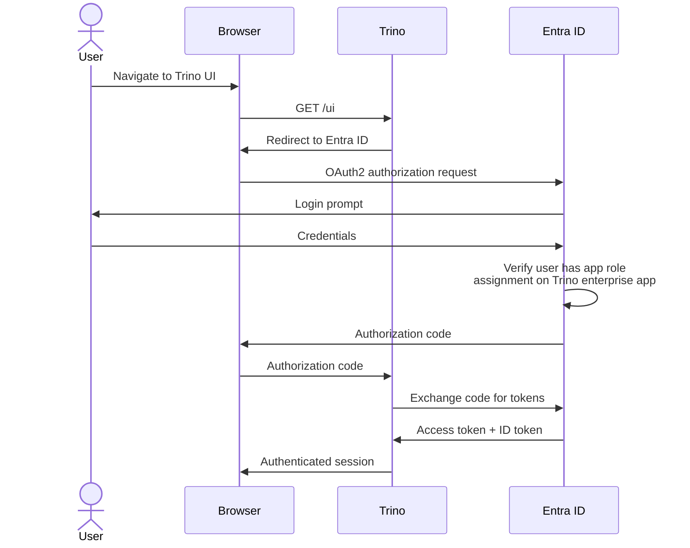
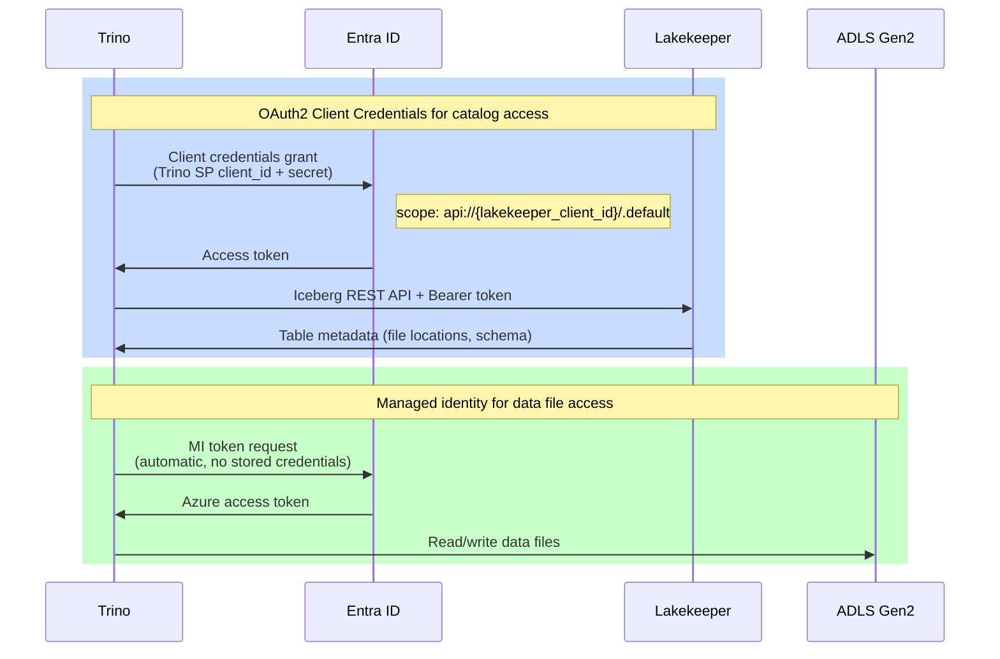
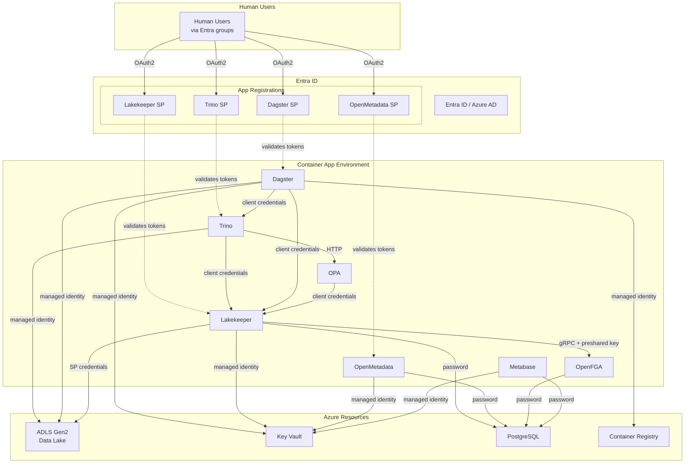

# Authentication Overview

This document provides an overview of how users and services authenticate to the [Project Name] platform.

For which identities exist and what permissions they have, see [Identities and Permissions](../infrastructure/identities.md). For how authorization decisions are enforced at query time, see [Authorization Architecture](../infrastructure/authorization.md).

## Authentication Methods

The platform uses four authentication methods, each suited to a different use case:

### 1. Interactive OAuth2 (Human Users)

Human users authenticate via OAuth2 Authorization Code Flow through Entra ID (Azure AD). This is used for all web UIs:

- **Lakekeeper UI** — SPA redirect flow (`/ui/callback`)
- **Trino Web UI** — Web redirect flow (`/oauth2/callback`)
- **Dagster Web UI** — Azure Container Apps built-in auth (`/.auth/login/aad/callback`)
- **OpenMetadata UI** — Web redirect flow with implicit grant (`/callback`)
- **Metabase** — Azure Container Apps built-in auth

Each application has its own Entra app registration. Users must be members of the appropriate Entra group (Users or Developers) to be granted an app role assignment, which is required for login. Without the assignment, Entra will reject the login attempt.

**How it works:**

1. User accesses a web interface
2. Application redirects to Entra ID for authentication
3. User logs in with their organizational credentials
4. Entra ID redirects back with an authorization code (or token, for implicit grant)
5. Application exchanges the code for access and ID tokens
6. User gets an authenticated session

### 2. OAuth2 Client Credentials (Service-to-Service)

Services authenticate to other services using the OAuth2 Client Credentials Flow. The service presents a client ID and client secret to Entra ID and receives an access token scoped to the target service.

| Source | Target | Scope |
| -------- | -------- | ------- |
| Trino | Lakekeeper | `api://{lakekeeper_client_id}/.default` — for Iceberg catalog queries |
| Dagster | Trino | `api://{trino_client_id}/.default` — for running SQL queries |
| Dagster | Lakekeeper | `api://{lakekeeper_client_id}/.default` — for table management |
| OPA | Lakekeeper | `api://{lakekeeper_client_id}/.default` — for permission checks |

For client credentials to work, the calling service's SP must have a **default app role assignment** on the target service's enterprise app. This is configured in each app module's `entra.tf`.

### 3. Password Authentication (JDBC Tools)

For applications that cannot use OAuth2 (typically JDBC-based tools), Trino supports username/password authentication with bcrypt-hashed passwords.

Currently configured password users:

| User | Purpose |
| ------ | --------- |
| `tableau` | Tableau connecting to Trino for dashboards and reports |

Password users are defined in `tf/modules/apps/trino/main.tf` in the `trino_password_users` local. Passwords are randomly generated and stored in Azure Key Vault as `trino-password-{username}`.

See [Trino Password Authentication](../trino/password-authentication.md) for setup details.

### 4. Managed Identity (Azure Resource Access)

Services access Azure resources (Storage, Key Vault, Container Registry) using user-assigned managed identities. Unlike service principals, managed identities authenticate automatically — no stored credentials are needed.

| Service | Managed Identity | Azure Resources Accessed |
| --------- | ----------------- | -------------------------- |
| Trino | `{system}-{env}-workload-trino-mi` | ADLS Gen2 (data lake reads/writes) |
| Dagster | `{system}-{env}-workload-dagster-mi` | ADLS Gen2, Key Vault, Container Registry |
| Lakekeeper | `{sys_short}-{env_short}-workload-lakekeeper-mi` | Key Vault (grants sync secrets), Container Registry (job images) |
| OpenMetadata | `{system}-{env}-workload-openmetadata-mi` | Key Vault (JWT signing keys) |
| Metabase | `{system}-{env}-workload-metabase-mi` | Key Vault (database credentials) |

Managed identities are created by each app module's OpenTofu configuration. The required Azure RBAC role assignments are defined in each module's `entra.tf` and are created automatically when `can_modify_entra = true`. In `dev`/`stg`, [AGENCY] must assign these roles manually.

## Authentication Flow Diagrams

### Human User Login (Trino Example)

### Service-to-Service Authentication (Trino to Lakekeeper)

### System Authentication Architecture

## Service-Specific Authentication

### Lakekeeper

- **Human access**: OAuth2 via SPA redirect flow (Entra app registration)
- **Service access**: OAuth2 client credentials (Trino SP, Dagster SP, OPA)
- **Storage access**: Service principal credentials (`Storage Blob Data Contributor` on the Lakekeeper SP)
- **Database access**: PostgreSQL username/password (stored in Key Vault)
- **OpenFGA access**: gRPC with preshared key

### Trino

- **Human access**: OAuth2 via web UI redirect flow; or Trino CLI with `--external-authentication`
- **JDBC tool access**: Password authentication (bcrypt-hashed, see [password authentication](../trino/password-authentication.md))
- **Service access**: Dagster authenticates via OAuth2 client credentials
- **Catalog access**: OAuth2 client credentials to Lakekeeper
- **Storage access**: Managed identity (`Storage Blob Data Contributor` on Trino MI)
- **Authorization**: Delegates all access decisions to OPA

### Dagster

- **Human access**: OAuth2 via Azure Container Apps built-in auth
- **Trino access**: OAuth2 client credentials (Dagster SP)
- **Lakekeeper access**: OAuth2 client credentials (Dagster SP)
- **Storage access**: Managed identity (Dagster MI)
- **Key Vault access**: Managed identity (Dagster MI)

### OpenMetadata

- **Human access**: OAuth2 via web redirect with implicit grant (ID + access tokens)
- **Internal JWT**: RSA key pair stored in Key Vault for internal token signing
- **Database access**: PostgreSQL username/password (stored in Key Vault)

### Metabase

- **Human access**: Entra authentication via Azure Container Apps built-in auth
- **Trino access**: Password authentication (as the `tableau` password user, or its own)
- **Database access**: PostgreSQL username/password (stored in Key Vault)

## Credential Storage

All credentials are stored in Azure Key Vault. No secrets are hardcoded in configuration or source code.

| Secret Type | Key Vault Naming Pattern | Example |
| ------------- | -------------------------- | --------- |
| App registration client secrets | `{app}-client-secret` | `lakekeeper-client-secret` |
| PostgreSQL passwords | `{app}-postgres-password` | `lakekeeper-postgres-password` |
| Trino password users | `trino-password-{username}` | `trino-password-tableau` |
| Encryption keys | `{app}-pg-encryption-key` | `lakekeeper-pg-encryption-key` |
| OpenFGA preshared key | `openfga-preshared-key` | |

## Implementation References

- **App registrations**: `tf/modules/apps/{app}/entra.tf` — defines each app's Entra configuration (the ideal state)
- **Managed identities**: Created in each app module's `main.tf`; RBAC role assignments in `entra.tf`
- **Password users**: `tf/modules/apps/trino/main.tf` — `trino_password_users` local
- **Identities reference**: [docs/infrastructure/identities.md](../infrastructure/identities.md) — complete inventory of all identities and their permissions