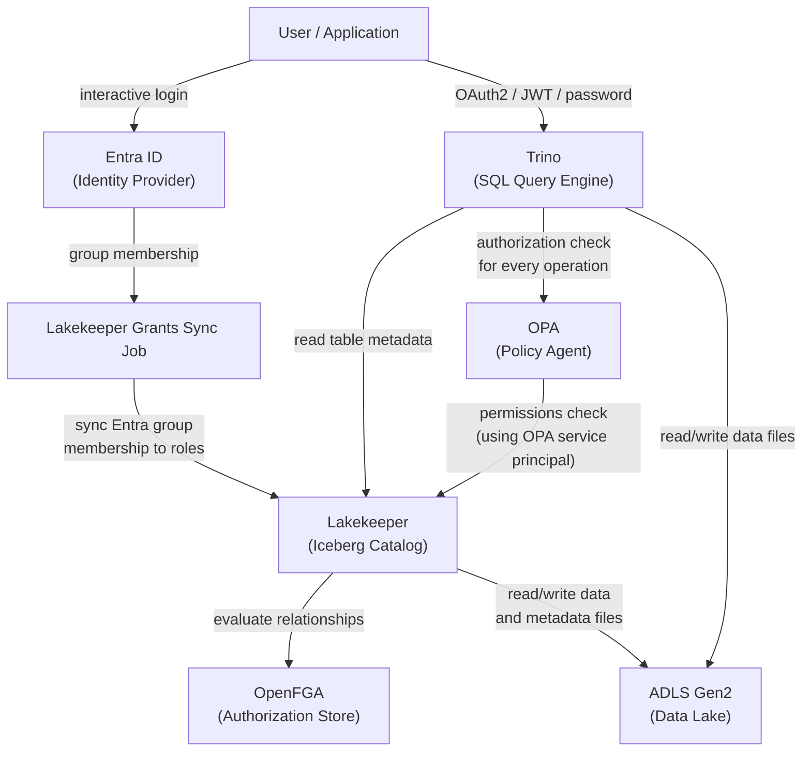
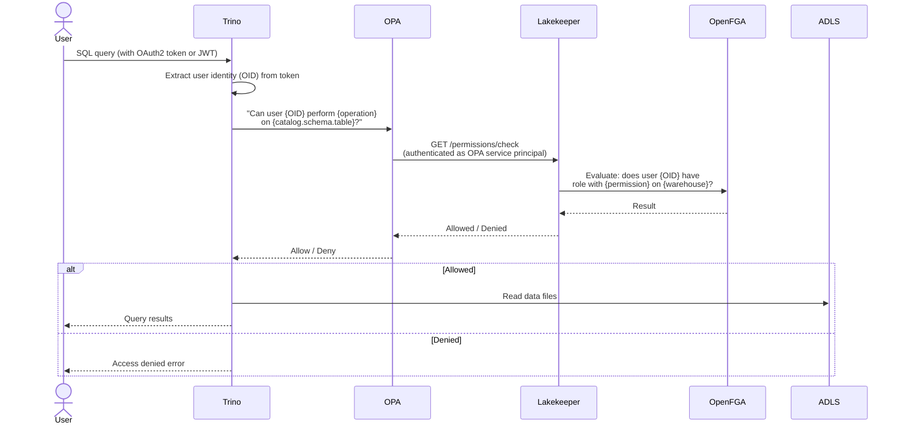
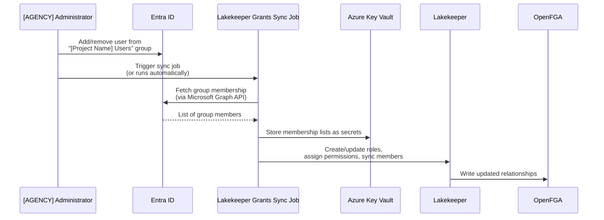

# Data Authorization Architecture

This document explains how access control is enforced in the [Project Name] — who can query which data, how that is controlled, and which components are involved.

## Overview

Authorization in the [Project Name] is layered across four components: **Lakekeeper**, **OpenFGA**, **OPA**, and **Trino**. Each plays a distinct role:

| Component | Role |
|-----------|------|
| **Lakekeeper** | Iceberg REST catalog — the index on top of the data lake. It knows what tables exist, where their data files live in ADLS, and other metadata. Lakekeeper also defines a permission model describing what actions users can take on its resources (warehouses, namespaces, tables). |
| **OpenFGA** | Authorization engine — stores and evaluates Lakekeeper's permission model. When any component needs to know whether a user is allowed to perform an action, the answer ultimately comes from OpenFGA. |
| **OPA** | Policy bridge between Trino and the authorization system. OPA receives Trino's access-control questions ("can user X read table Y?") and translates them into permission checks against Lakekeeper's API, which in turn evaluates them via OpenFGA. OPA's `.rego` policy files — downloaded from the Lakekeeper project — encode this translation logic. |
| **Trino** | SQL query engine. Trino delegates every access-control decision to OPA before executing an operation, and enforces whatever OPA decides. |

User roles are managed through **Entra ID groups** and synced to Lakekeeper by a background job. Neither OPA nor OpenFGA are configured directly — they reflect the permission model and role assignments defined in Lakekeeper.

## Component Relationships



## Query Authorization Flow

When a user runs a SQL query against Trino, the following happens before any data is read:



A few things worth noting about this flow:

- **OPA does not use the user's token to call Lakekeeper.** It authenticates using its own service principal credentials. The user's identity (an Entra object ID) is extracted from their token by OPA and passed as a parameter to the Lakekeeper permissions API.
- **Trino asks OPA about every operation**, not just reads — including schema listing, `SHOW TABLES`, metadata access, and session property changes. OPA's custom extension policies allow certain harmless operations (like reading system catalog tables) for all authenticated users without calling Lakekeeper.
- **OpenFGA is not called directly by OPA or Trino.** Lakekeeper is the only component that talks to OpenFGA. When OPA calls Lakekeeper's permissions API, Lakekeeper evaluates the request against the permission model in OpenFGA and returns the result.

## How Permissions are Managed

Permissions are defined by Entra ID group membership and synced to Lakekeeper by the grants sync job:



**Roles and what they grant:**

| Lakekeeper Role | Entra Group | Permissions |
|----------------|-------------|-------------|
| `users` | [Project Name] Users | `describe`, `select` on the project (read access to all tables) |
| `developers` | [Project Name] Developers | `admin`, `operator` at the server level |

Service principals (like Dagster and Trino) are granted `data_admin` at the project level directly, independent of the group-based role system.

To add or remove a user, change their Entra group membership and re-run the grants sync job. See [Lakekeeper — Role & Permission Management](./lakekeeper.md#role--permission-management) for step-by-step instructions.

## OPA Policy Files

OPA loads its policy files from an Azure Files share at startup. The files are downloaded from the [Lakekeeper GitHub repository](https://github.com/lakekeeper/lakekeeper) during `tofu apply` and uploaded to the share. The policy set is organized as:

```text
policies/
├── configuration.rego        # Configures OPA with Lakekeeper endpoint and credentials
├── trino/
│   ├── main.rego             # Entry point — combines all allow rules
│   ├── user.rego             # User identity extraction from tokens
│   ├── check.rego            # Calls Lakekeeper permissions API
│   ├── allow_catalog.rego    # Catalog-level access rules
│   ├── allow_schema.rego     # Schema-level access rules
│   ├── allow_table.rego      # Table-level access rules
│   ├── allow_view.rego       # View-level access rules
│   ├── allow_default_access.rego  # Default permissions for system resources
│   └── allow_extensions.rego      # Custom rules added by this deployment
└── lakekeeper/
    ├── authentication.rego   # Token validation for Lakekeeper API requests
    ├── check.rego            # Authorization checks for Lakekeeper API operations
    └── identifiers.rego      # Identity parsing utilities
```

The `allow_extensions.rego` file contains rules specific to this deployment — for example, allowing all authenticated users to read from Trino's system catalog (which dbt requires) and to set session properties. When OPA policies are updated (e.g., when upgrading Lakekeeper), `tofu apply` re-downloads the policy files and restarts the OPA container.

## Related Documentation

- [Lakekeeper — Role & Permission Management](./lakekeeper.md#role--permission-management) — How to add/remove users and run the grants sync
- [Trino](./trino.md) — Trino authentication methods and admin consent setup