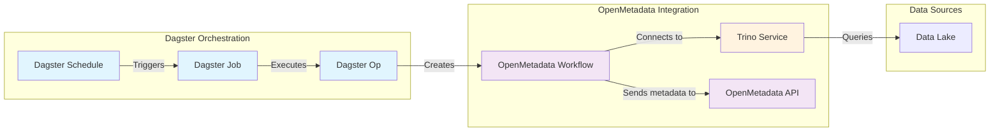

# OpenMetadata Ingestion for [AGENCY] [Project Name]

This document describes the OpenMetadata ingestion implementation for the [AGENCY] [Project Name] data platform. OpenMetadata serves as our centralized metadata catalog, providing data discovery, lineage tracking, and data quality profiling capabilities.

## Overview

The [AGENCY] [Project Name] uses OpenMetadata to catalog and monitor data assets across our data platform. Our implementation provides:

- **Metadata Ingestion**: Discovers and catalogs tables, views, and schemas
- **Lineage Tracking**: Maps data flow and dependencies between assets
- **Data Profiling**: Analyzes data quality and statistics

A key differentiator of our approach is using **Python-native configuration** instead of YAML files, providing type safety, IDE support, and easier debugging.

## Architecture

### Ingestion Flow



### Dagster Integration Pattern

The integration follows a consistent pattern that makes jobs discoverable for both scheduled and manual execution:

1. **Op Definition**: Encapsulates the OpenMetadata workflow execution
2. **Job Creation**: Groups related ops into executable jobs
3. **Schedule Registration**: Automates execution and registers jobs in Dagster UI
4. **Definitions Export**: Makes jobs available for manual triggering

This pattern is implemented in:

- `pipelines/openmetadata/trino.py` - Trino-specific ops and jobs
- `pipelines/definitions/definitions.py` - Schedule registration

## Implementation Approach

### Python-Native Configuration

Unlike the standard YAML-based approach documented in OpenMetadata's guides, we configure workflows using Python classes from the `metadata` package. This provides:

- **Type Safety**: IDE autocomplete and type checking
- **Compile-Time Validation**: Catch configuration errors early
- **Better Debugging**: Step through configuration creation

### Finding and Implementing Connectors

1. **Discover Available Connectors**
   - Browse the [OpenMetadata Connectors documentation](https://docs.open-metadata.org/latest/connectors)
   - Find the "Run Externally" section for your data source
   - Example: [Trino YAML configuration](https://docs.open-metadata.org/latest/connectors/database/trino/yaml)

2. **Translate YAML to Python**
   - Explore the `metadata` package structure in your IDE:

     ```sh
     .venv/lib/python3.12/site-packages/metadata/
     ├── workflow/           # Workflow execution classes
     └── generated/schema/   # Configuration schemas
         └── metadataIngestion/  # Pipeline definitions
     ```

   - Find the appropriate pipeline class (e.g., `DatabaseServiceMetadataPipeline`)
   - Use IDE navigation to explore nested schema definitions

3. **Build Configuration**
   - Start with the pipeline class to understand required fields
   - Navigate into each field's type definition
   - Build configuration using Python classes with full IDE support

## Current Implementation

### Directory Structure

```sh
pipelines/openmetadata/
├── __init__.py     # Exports resources and schedules
├── common.py       # Base classes and shared resources
├── trino.py        # Trino-specific ingestion implementation
├── dagster.py      # Dagster pipeline ingestion
└── dbt.py          # DBT artifact ingestion
```

### Key Components

**Base Class Pattern** (see `pipelines/openmetadata/common.py`):

- `OpenMetadataResource`: Manages authentication configuration
- `OpenMetadataIngestionOp`: Abstract base class for all ingestion operations
- Provides common workflow execution and error handling

**Trino Implementation** (see `pipelines/openmetadata/trino.py`):

- Three specialized operations:
  - `TrinoMetadataIngestionOp`: Discovers tables and schemas
  - `TrinoLineageIngestionOp`: Extracts query-based lineage
  - `TrinoProfileIngestionOp`: Analyzes data quality metrics
- Two schedules:
  - Daily ingestion for metadata and lineage
  - Weekly profiling for data quality

### Authentication

The implementation uses Azure AD OAuth2 authentication:

- Service principal credentials from environment variables
- Token-based authentication to Trino
- JWT tokens for OpenMetadata API access

See `pipelines/openmetadata/common.py` for the authentication setup.

## Debugging with VSCode

The project includes a VSCode launch configuration for interactive debugging:

### Setup

1. Open the project in VSCode
2. Ensure your `.env` file contains required credentials
3. Use the "Debug Dagster job: *" launch configuration

### Debugging Workflow

1. **Set Initial Breakpoint**
   - Place a breakpoint at the `return Source(...)` line in your ingestion class
   - This lets you verify all configuration values before execution

2. **Launch Debugger**
   - Press F5 and select "Debug Dagster job: *"
   - Enter the job name (e.g., `ingest_trino_job`)
   - The debugger will stop at your breakpoint

3. **Verify Configuration**
   - Inspect all variables in the debugger
   - Ensure credentials and connection details are correct

4. **Debug Pipeline Execution**
   - Enable "Uncaught Exceptions" in the debugger
   - Continue execution (F5)
   - The debugger will catch any errors in the OpenMetadata pipeline

Key configuration in `.vscode/launch.json`:

- `justMyCode: false` - Allows debugging into OpenMetadata library code
- `subProcess: true` - Captures errors from child processes

## Adding New Ingestion Services

To add support for a new data source:

1. **Create Service Module**

   ```python
   # pipelines/openmetadata/your_service.py
   from .common import OpenMetadataIngestionOp

   class YourServiceIngestionOp(OpenMetadataIngestionOp):
       def create_source_config(self, context):
           # Implementation specific to your service
   ```

2. **Define Dagster Components**
   - Create ops for each ingestion type (metadata, lineage, profiling)
   - Group ops into jobs
   - Define schedules for automation

3. **Register in Dagster**
   - Export schedules in `pipelines/openmetadata/__init__.py`
   - Add to schedules list in `pipelines/definitions/definitions.py`

4. **Configure Resources**
   - Add any required resources to `pipelines/definitions/definitions.py`
   - Set environment variables for credentials

Refer to `pipelines/openmetadata/trino.py` for a complete implementation example.

## Configuration

### Environment Variables

The following environment variables are required for OpenMetadata ingestion:

```bash
# OpenMetadata API Configuration
OPENMETADATA_API_URL=https://openmetadata.your-domain.com/api
OPENMETADATA_API_TOKEN=your-jwt-token

# Dagster Configuration (for Dagster ingestion)
DAGSTER_HOST=http://dagster-dagster-webserver.dagster.svc.cluster.local
# Optional, depending on authentication setup, can usually be blank
DAGSTER_TOKEN=your-dagster-token

# Service-specific credentials are configured in each implementation
```

For local development, you can point `DAGSTER_HOST` to a remote Dagster instance:

- Production: `https://dagster.datahub.[AGENCY].com`
- Consultant: `https://[APP_URL]`
- Local: `http://localhost:3000` (if running Dagster locally)

## Operations

### Manual Execution

Jobs registered through schedules are automatically available in the Dagster UI:

1. Navigate to the Dagster UI
2. Go to "Jobs" section
3. Find your ingestion job (e.g., `ingest_trino_job`)
4. Click "Launch Run" for manual execution

You can also execute jobs from the command line:

```bash
# Execute a specific OpenMetadata ingestion job
uv run dagster job execute -m pipelines.definitions -j ingest_trino_job
uv run dagster job execute -m pipelines.definitions -j ingest_dagster_job
uv run dagster job execute -m pipelines.definitions -j ingest_dbt_job
```

### Monitoring

- Check job status in Dagster UI under "Runs"
- View ingestion results in OpenMetadata UI
- Monitor logs for any errors or warnings

### Common Issues

1. **Authentication Failures**
   - Verify environment variables are set
   - Check service principal permissions
   - Ensure tokens haven't expired

2. **Connection Timeouts**
   - Verify network connectivity
   - Check service endpoints
   - Review firewall rules

3. **Schema Discovery Issues**
   - Confirm filter patterns in configuration
   - Check user permissions on source system
   - Review Dagster job logs for details

## References

- [OpenMetadata Documentation](https://docs.open-metadata.org/)
- [OpenMetadata Connectors](https://docs.open-metadata.org/latest/connectors)
- [Dagster Documentation](https://docs.dagster.io/)
- Project Implementation:
  - `pipelines/openmetadata/` - Implementation code
  - `tf/helm_releases.tf` - Infrastructure configuration
  - `.vscode/launch.json` - Debugging setup