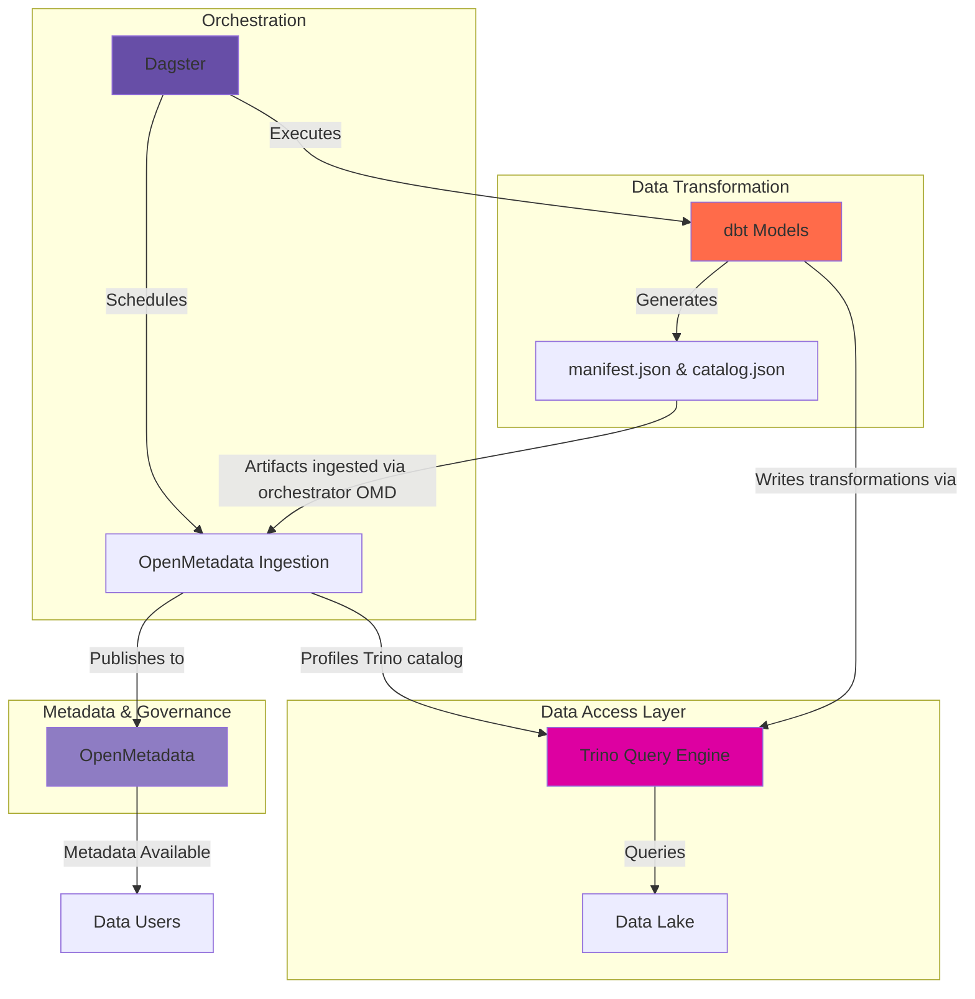

# Integration Overview: Dagster, dbt, and OpenMetadata

This document describes how Dagster, dbt, and OpenMetadata work together in the [AGENCY] [Project Name], forming a cohesive data platform with orchestration, transformation, and governance capabilities.

## The Integration Pattern

Our data platform integrates four core tools:

- **[Trino](https://trino.io/)**: Distributed SQL query engine providing unified access to the data lake
- **[dbt](https://docs.getdbt.com/)**: Transforms raw data into analytics-ready models using SQL
- **[Dagster](https://docs.dagster.io/)**: Orchestrates data pipelines and metadata ingestion, and manages dependencies
- **[OpenMetadata](https://docs.open-metadata.org/)**: Catalogs metadata, tracks lineage, and enables data governance

### How They Work Together



**The Flow:**

1. **Trino** provides SQL access to data lake files (Parquet, Iceberg tables, etc.)
2. **dbt** transforms data via Trino and generates metadata artifacts (manifest.json, catalog.json)
3. **Dagster** orchestrates dbt runs and OpenMetadata ingestion jobs
4. **OpenMetadata** ingests:
   - dbt artifacts for model definitions and lineage
   - Trino database catalog and table schemas
   - Data quality profiles from Trino queries
5. **OpenMetadata** provides unified metadata catalog to end users - this facilitates data discoverability, documentation, and governance

## Metadata Management Strategy

OpenMetadata serves as the single source of truth for data governance, but different tools contribute metadata in different ways. Understanding which tool controls which metadata is crucial for avoiding conflicts.

### Tags

**Purpose**: Categorize assets by domain, quality tier, usage, sensitivity, and access level

**dbt Behavior**: [Appends to existing tags](https://docs.open-metadata.org/latest/connectors/ingestion/workflows/dbt#tags)

**Recommended Strategy**:

- Use dbt for programmatic tagging based on model properties
- Use OpenMetadata UI for manual classification and enrichment
- Common tag categories:
  - **Domain**: `finance`, `operations`, `ridership`, `gtfs`
  - **Quality/Medallion**: `bronze`, `silver`, `gold`
  - **Usage**: `reporting`, `analytics`, `ml`
  - **Access**: `public`, `internal`, `restricted`

**Example dbt configuration**:

```yaml
models:
  - name: dim_stops
    meta:
      tags:
        - gtfs
        - gold
        - public
```

### Owners

**Purpose**: Assign accountability for data assets

**dbt Behavior**: [Overwrites existing owners](https://docs.open-metadata.org/latest/connectors/ingestion/workflows/dbt#owners)

**Recommended Strategy**:

**Prefer OpenMetaData to set Ownership** to prevent unintentional overwrites. dbt is able to set ownership via meta properties, however this will overwrite the assigned ownership when dbt metadata is imported. Ingesting ownership can be configured via OpenMetadata ingest configuration, via either importing or ignoring dbt ownership yaml-based configuration.

OpenMetadata supports multiple ownership models:

- **Individual users**: Direct assignment to specific people
- **Teams**: Assignment to organizational units or groups
- **Combination**: Primary owner (individual) + team ownership

**Best Practice**:

- Create teams in OpenMetadata based on business units/departments
- Set up email listservs/groups as teams
- Assign team ownership for organizational accountability
- Optionally assign a primary individual owner within the team
- Manage all ownership through OpenMetadata UI to maintain control

### Tier

**Purpose**: Indicate the importance and criticality of data assets (e.g., Tier 1 = Critical, Tier 5 = Experimental)

**dbt Behavior**: [Overwrites tier](https://docs.open-metadata.org/latest/connectors/ingestion/workflows/dbt#tier)

**Recommended Strategy**:

- Tiers can only be set once per asset in dbt
- Choice between governance vs. automation
  - **dbt-managed**: Define tiers in dbt model meta, let dbt set them
  - **Manually managed**: Disable tier ingestion from dbt, set through OpenMetadata UI

**Example dbt configuration**:

```yaml
models:
  - name: fct_daily_ridership
    meta:
      tier: Tier1  # Critical production metric
```

### Description and Documentation

**Purpose**: Provide context, definitions, and usage guidance for data assets

**dbt Behavior**: [Syfare descriptions and documentation](https://docs.open-metadata.org/latest/connectors/ingestion/workflows/dbt#descriptions). dbt will overwrite any manual edits made via OpenMetadata.

**Recommended Strategy**:

- **Primary source**: Maintain model and column descriptions in dbt as part of code review process. Utilize documentation blocks and where possible. Governance should determine if documentation should live within dbt or OpenMetadata.
- **Enrichment**: Use OpenMetadata for additional business context not suited for code
- dbt descriptions should focus on technical details, particularly at the column-level
- OpenMetadata descriptions can add business context and usage examples
- Determine which documentation lives in dbt and which documentation lives in OpenMetadata and utilize user permissions to enforce this

**dbt documentation**:

```yaml
models:
  - name: dim_routes
    description: |
      Dimension table for transit routes. Conforms to GTFS routes.txt specification.
    columns:
      - name: route_id
        description: Unique identifier for the route
```

### Glossary Terms

**Purpose**: Define business terms and metrics methodology in a centralized business glossary

**Integration**: [dbt Glossary Ingestion](https://docs.open-metadata.org/latest/connectors/ingestion/workflows/dbt/ingest-dbt-glossary)

**How It Works**:

- Group related business terms together in OpenMetadata
- Define terms, formulas, and methodology (including SQL snippets)
- Link dbt tables and columns to glossary terms
- **Note**: Glossaries must be configured in OpenMetadata before dbt models can be connected to them

**Example Use Cases**:

- **Metrics definitions**: "Daily Ridership" = "Count of unique fare validations per calendar day"
- **Business terms**: "Headway" = "Time interval between consecutive vehicle arrivals"
- **Calculation methodology**: Include SQL snippets showing how metrics are computed

**Setup**:

1. Create glossary terms in OpenMetadata
2. Configure dbt glossary ingestion workflow
3. Tag dbt models with glossary terms using meta properties
4. Ingestion will link models to corresponding glossary entries

## Team and Access Management

### Teams

**Purpose**: Organize users by business units and responsibility areas

**Configuration**: [Set up teams in OpenMetadata](https://docs.open-metadata.org/latest/how-to-guides/admin-guide/teams-and-users)

**Recommended Structure**:

- Align teams with organizational structure or user types

**Benefits**:

- Simplified ownership assignment
- Role-based access control foundation
- Clear accountability by department

### Notifications and Alerts

**Purpose**: Keep stakeholders informed about data quality issues, schema changes, and operational events

**Documentation**: [OpenMetadata Alerts Guide](https://docs.open-metadata.org/latest/how-to-guides/admin-guide/alerts)

**Common Alert Scenarios**:

- Data quality test failures
- Schema changes on critical tables
- Pipeline failures or delays
- Ownership or other changes

**Integration with Dagster**:

- Dagster job failures can trigger OpenMetadata alerts
- OpenMetadata can be configured to send notifications to:
  - Email
  - Microsoft Teams
  - Webhook integrations

## Implementation in [Project Name]

### Current Setup

Our implementation includes three main ingestion workflows, all orchestrated by Dagster:

1. **Trino Metadata Ingestion** ([docs](ingestion.md))
   - **Dagster orchestrates** the ingestion of Trino database catalog and profiles
   - Discovers tables and schemas from data lake via Trino
   - Extracts query-based lineage from Trino query history
   - Profiles data quality metrics by executing statistical queries through Trino

2. **dbt Artifact Ingestion**
   - **Dagster orchestrates** the ingestion of dbt-generated metadata
   - Ingests manifest.json - model definitions, dependencies
   - Ingests catalog.json - column-level metadata
   - Syfare dbt tags, descriptions, and relationships
   - Syfare run_results.json - actual results of materialization and test results via dagster orchestration of `dbt build` commands

3. **Dagster Pipeline Ingestion**
   - **Dagster orchestrates** self-documentation of its own pipeline structure
   - Documents pipeline structure and dependencies
   - Links orchestration to data assets
   - Provides operational context

## Additional Resources

- [OpenMetadata dbt Integration](https://docs.open-metadata.org/latest/connectors/ingestion/workflows/dbt)
- [OpenMetadata Teams and Users Guide](https://docs.open-metadata.org/latest/how-to-guides/admin-guide/teams-and-users)
- [OpenMetadata Alerts Configuration](https://docs.open-metadata.org/latest/how-to-guides/admin-guide/alerts)
- [dbt Meta Fields Documentation](https://docs.getdbt.com/reference/resource-properties/meta)
- [Dagster with dbt](https://docs.dagster.io/integrations/dbt)
- [Local Implementation: OpenMetadata Ingestion](ingestion.md)