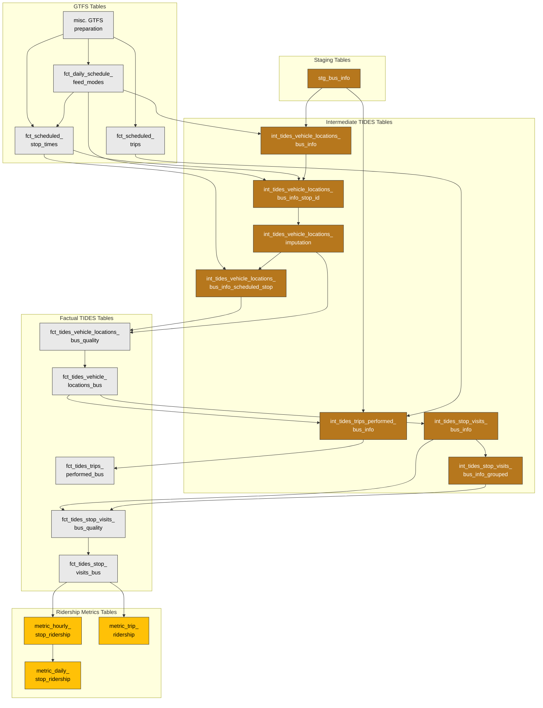

# Bus info

This document explains how the bus info data flows through the warehouse, from ingestion to the key mart tables used for analysis.

## Overview and Architecture

### Purpose

- In the TIDES architecture, Bus info data is used to generate Stop Visits, which summarizes stop-level ridership, boardings, alightings, and other information; Vehicle Locations; and Trips Performed.

- Stop Visits, described above, also serves as an input to create ridership metric models for ridership by hourly stops and daily stops and by trip.

### Source System

Bus info data is pulled from `bus_data[PRD/QA]1.BUSINFO.BUS_INFO_DATA_RAW`.
This data is generated from the vendor_1 Automatic Vehicle Location (AVL) system through the vendor_1 installed on buses.
The data in this table has information from buses moving through their routes, e.g. GPS location, passenger count, speed, as well as information keyed in by the operator, e.g. operator ID, work ID, and scheduled route information as derived from the information from the operator and GPS, e.g. stop sequence, route ID, schedule deviation.

### Data Flow

The diagram below shows the simplified data flow for the Bus info data, focusing on how it flows from the Oracle database through staging, intermediate transformations, dimension and fact tables, combines with GTFS data and ultimately flows on to TIDES models.

### Translation to TIDES Schema

The diagram below shows an overview of how the Bus info data passes through multiple intermediate models, connecting with GTFS data, and transforms into the TIDES models.

## Transformations and Quality

Transformations occur via dbt-generated SQL. These transformations are elaborated on in the sections below.

### Stop ID

The `stop_id` field is used to identify the stop a vehicle is approaching or serving and should reference GTFS.
The `ta_geo_id` field in the Bus info data is joined with `stop_id` from GTFS stops.
For locations that will be included in stop visits, i.e. where schedule relationship is either "Skipped" or "Scheduled", `stop_id` is then imputed by finding the closest scheduled stop on the same date and the same trip from `fct_scheduled_stop_times`, which is has one row per scheduled stop visit and is generated from GTFS stop times, stops, trips and routes.
This transformed field is created in `int_tides_vehicle_locations_bus_info_stop_id` as `stop_id_imputed` and becomes `stop_id` in `fct_tides_vehicle_locations_bus`.

### Trip ID Performed

Performed trips are split into "candidate trips" using the first record of the day for a given vehicle ID or a if a vehicle has a gap in service of 1 or more hours.
Stable trip IDs are created based on service_date, vehicle_id, pattern_id and candidate trip start time.
This transformed field is created in `int_tides_vehicle_locations_imputation` as `trip_id_performed_imputed` and becomes `trip_id_performed` in `fct_tides_vehicle_locations_bus`.

### Stop Sequence

#### Scheduled Stop Sequence

The `scheduled_stop_sequence` is created from joining with GTFS on trip id and stop id and incrementing on how many times a specific stop has been visited on a trip.
This ensures a consecutive stop sequence for loop routes and that the first stop visit on a scheduled stop sequence is 1.
This transformed field is created in `int_tides_vehicle_locations_bus_info_scheduled_stop` as `scheduled_stop_sequence_imputed` and becomes `scheduled_stop_sequence` in `fct_tides_vehicle_locations_bus`.

#### Trip Stop Sequence

Trip stop sequence is the stop sequence within a given trip performed. As this corresponds to the actual trip performed, trip stop sequence does not follow the scheduled stop sequence. Trip stop sequence is calculated as the order of stops for a given service date, trip ID (after imputation) ordered by event timestamp and the hash of the `file_name` and `batch_row_number` (created when loading data into analytic database) for tiebreaking.
This transformed field is created in `int_tides_vehicle_locations_imputation` as `trip_stop_sequence_imputed` and becomes `trip_stop_sequence` in `fct_tides_vehicle_locations_bus`.

### Design Context: Stop-Level Aggregation in Vehicle Locations

TIDES `vehicle_locations` is the most disaggregate vehicle location source, but producing usable stop-level fields from raw Bus info pings requires *three* separate imputation passes where data is:

1. filtered to the stop-level
2. imputations are performed
3. imputated values are filled to other pings

This is relatively less performant and harder to follow than an approach that *started* at the stop visits level, but is necessary to satisfy the TIDES schema. These three separate imputation passes are:

1. **Stop ID reassignment** (`int_tides_vehicle_locations_bus_info_stop_id`): Bus info's raw `ta_geo_id` doesn't reliably match GTFS `stop_id`. For Scheduled/Skipped records, the model imputes `stop_id` by finding the closest GTFS scheduled stop using haversine distance weighted by sequence difference, within a 300m bounding box.
2. **Trip stop sequence assignment** (`int_tides_vehicle_locations_imputation`): After filtering to records with valid imputed stop IDs and non-0/-1 trip stop sequences, new stop visits are detected by observing changes in `stop_id_imputed` over time. Each new visit is assigned a consecutive `trip_stop_sequence`.
3. **Scheduled stop sequence assignment** (`int_tides_vehicle_locations_bus_info_scheduled_stop`): Joins to GTFS `fct_scheduled_stop_times`, handling loop routes by counting the nth visit to each stop on a trip.

> **Implementation note:** Each of these three passes is further decomposed into multiple materialized intermediate models (located in `models/intermediate/bus_info/imputation/`). This is a Trino performance optimization: materializing slim intermediate tables between chained window functions and joins keeps each query's stage count within Trino's planning limits and avoids `EXCEEDED_LOCAL_MEMORY_LIMIT` failures on the build side of hash joins. See [#779](https://github.com/[ORGANIZATION]/[project-name]/issues/779) for background.

### Dwell

In Stop Visits, dwell is calculated as the difference between `actual_departure_time` and `actual_arrival_time` in seconds as the dwell in Bus info does not always equal the difference between `actual_departure_time` and `actual_arrival_time`.
This transformed field is created in `int_tides_stop_visits_bus_info_grouped` as `dwell_imputed` and becomes `dwell` in `fct_tides_stop_visits_bus`.

### Distance

In Stop Visits, distance is calculated from odometer readings for each `vehicle_id`.
This field is created in `int_tides_stop_visits_bus_info` as `distance`.

### Aggregation of Bus info Events

As Bus info provides snapshots of information as a bus continues along its route, occasionally, there may be multiple snapshots of information at the same service stop, e.g. a bus waits at a single stop for multiple minutes and a row in Bus info is created for when the bus arrives at the stop and when it leaves.
Therefore, for Stop Visits, which summarizes events by trip and stop for each service date, aggregation of Bus info events is needed to ensure each row is one stop.
These aggregations are done in `int_tides_stop_visits_bus_info_grouped`.
To aggregate, information is aggregated by `service_date`, `trip_id_performed`, `trip_stop_sequence`, and `vehicle_id`.
The remaining columns are aggregated as follows:

| Column Name | Aggregation |
| ----------- | ----------- |
| scheduled_stop_sequence | First (as ordered by actual_arrival_time) |
| pattern_id | First non-null |
| vehicle_id | First non-null |
| dwell | Sum |
| stop_id | First (as ordered by actual_arrival_time) |
| timepoint | If any are timepoints, then marked as timepoint |
| schedule_arrival_time | Min |
| schedule_departure_time | Max |
| actual_arrival_time | Min |
| actual_departure_time | Max |
| distance | Sum |
| boarding_1 | Sum |
| alighting_1 | Sum |
| boarding_2 | Sum |
| alighting_2 | Sum |
| departure_load | Last (as ordered by actual_arrival_time) |
| door_open | Min |
| door_close | Max |
| door_status | If any marked as "All doors opened" then "All doors opened".   If both "Front door opened and back doors remain closed" and "Back doors opened and front door remained closed" then "All doors opened".    Then, if any marked as the following then the following in this order:    - "Front door opened and back doors remain closed"   - "Back doors opened and front door remained closed"   - "Other configuration" |
| ramp_deployed_time | Sum |
| ramp_failure | If any marked as ramp_failure, then ramp_failure |
| kneel_deployed_time | Sum |
| lift_deployed_time | Sum |
| bike_rack_deployed | If any marked as deployed, then marked as deployed |
| bike_load | Sum |
| revenue | Sum |
| number_of_transactions | Sum |
| schedule_relationship | If any marked as the following then the following in this order:   - "Scheduled"   - "Skipped"   - "Added"   - "Missing" |
| custom_ramp_deployed_count | Sum |

## Key Mart Tables

| Table | Description |
| ----- | ----------- |
| `fct_tides_vehicle_locations_bus` | Valid vehicle location pings. |
| `fct_tides_stop_visits` | Summarized boarding, alighting, arrival, departure, and other events (kneel engaged, ramp deployed, etc.) by trip and stop for each service date. |
| `fct_tides_trips_performed_bus` | Trips performed for each service date. |

## Known Limitations and Notes

### Differences between [Project Name] Implementation and TIDES Schema Architecture

The [Project Name] defines relationships between the Bus info-based models and the GTFS models differently from [the TIDES Schema Architecture](https://tides-transit.org/main/architecture/#relationships):

- `stop_visits` does not yet incorporate GTFS data for `schedule_arrival_time`, `schedule_departure_time`, and `timepoint` fields.
- Rather than a direct connection between GTFS `stop_times` and `vehicle_locations`, `fct_scheduled_stop_times` is used to build a picture of scheduled service at each service date. Similarly, `trips_performed` is connected to schedule data via `fct_scheduled_trips`, rather than directly to a GTFS `trips` table.
- Patterns are not defined in the GTFS or TIDES specification, but are used to identify when trips in `vehicle_locations` have a schedule relationship.
- The TIDES `passenger_events` table is not implemented from Bus info data. The `passenger_events` schema is designed for individual event-level passenger records, while Bus info APC data is already aggregated to door-level counts per stop visit (e.g., `stop_front_door_entry`, `stop_back_door_exit`). Instead, APC data is incorporated directly into `stop_visits` alongside `vehicle_locations` and `stg_bus_info`. (This is also noted in `docs/warehouse/gtfs_schedule_data.md`.) `passenger_events` is currently only implemented for rail faregate (station-based) data.

### APC Data and Filtering Gotchas

TIDES vehicle locations models intentionally do not carry APC data (boardings, alightings, passenger load). APC fields flow separately: `int_tides_stop_visits_bus_info` joins vehicle locations data back to `stg_bus_info` (on `_row_id`) to retrieve boarding/alighting counts and passenger load.

However, `fct_tides_vehicle_locations_bus` only includes records flagged `is_valid`. Records filtered out during imputation (e.g., those with `trip_stop_sequence` of 0 or -1, or without an imputed `stop_id`) are excluded from vehicle locations and therefore from stop visits, even if the original `stg_bus_info` record had meaningful APC data attached.

The vehicle locations quality model (`fct_tides_vehicle_locations_bus_quality`) previously included `has_positive_trip_stop_sequence` and `dup_row_to_keep` in its `is_valid` filter, but these were removed because they caused loss of records associated with ridership. Some records that are still filtered (e.g., stop sequence 0 and -1) may represent non-revenue "between trips" movements where boardings could be operators getting on and off rather than actual passengers, but this has not been fully confirmed (see [ticket 602](https://github.com/[ORGANIZATION]/[project-name]/issues/602)).

### Ridership Sum Discrepancies

Comparisons between bus info ridership aggregations and other ridership sources (e.g., Trace, published ridership figures) have shown differences (see table below, created on 2025-11-20). Further work on reconciling data quality was deferred in favor of other priorities.

| Date      | TIDES Stop Visits - Bus | Bus info | Daily Report |
|-----------|-------------------------|-----------|--------------|
| 3/9/2025  | 171,702                 | 190,977   | 199,524      |
| 3/10/2025 | 335,969                 | 370,050   | 402,337      |
| 3/11/2025 | 348,519                 | 381,170   | 430,845      |

Currently known differences in these sources include:

- Delays in arrival of data from certain buses
- Visits where trip_id cannot be determined, preventing certain downstream data cleaning
- Boarding and Alighting records ‘between’ trips in Bus info not yet fully captured in TIDES
- Other cleaning/filtering steps that differ between sources.

### Other Notes

- Currently, some trip IDs have high stop sequences at the beginning of the trip, which may be associated with stops on the vehicle's previous trip. Further exploratory data analysis is needed to confirm (see [ticket 603](https://github.com/[ORGANIZATION]/[project-name]/issues/603)).
- Bus info contains many events in which the stop sequence is -1 or 0. Further analysis is needed to determine if these events can be used to indentify non-revenue movements and to confirm that there are no riders for these movements (see [ticket 602](https://github.com/[ORGANIZATION]/[project-name]/issues/602)).
- Currently, a single `trip_id_performed` can be associated with multiple `vehicle_ids` in the Bus info models. In practice, `trip_id_performed` should be associated with a single `vehicle_id`. There should either be a quality flag added to `vehicle_locations` to denote performed trip ids with multiple vehicle ids (see [ticket 432](https://github.com/[ORGANIZATION]/[project-name]/issues/432)) or it may be worth updating how `trip_id_performed` is calculated to include partitioning by `vehicle_id`.
- As noted above, many of the transformations related to stop information, e.g. `stop_id` and `trip_id_performed`, are made in advance of `fct_tides_vehicle_locations_bus`. This is in keeping with the [TIDES schema for Vehicle Locations](https://tides-transit.org/main/tables/#vehicle-locations) but also means that there can be stop information that is associated with vehicle pings that are not a stop visit, e.g. some vehicle pings that are leading up to a stop may have the stop id for the upcoming stop.