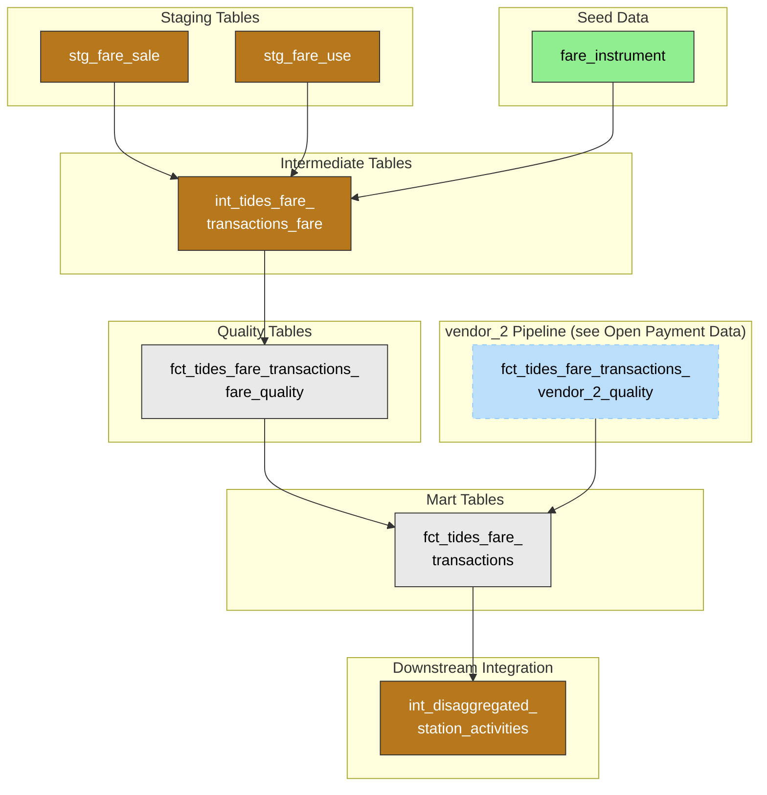

# FARE SmarTrip Fares Data

## Overview and Architecture

### Purpose

- Conform SmarTrip farecard transactions (sales, loads, and usage events) to the standard TIDES fare transactions format.
- Enable analysis of traditional farecard-based fare transactions to understand customer travel patterns and fare collection.
- Contribute to downstream models on station activities, combining with open payment and faregate data for comprehensive ridership analysis.

### Source System

[AGENCY]'s fare collection for traditional SmarTrip cards is managed through the **New Card System (FARE)**, which records both sale/load transactions and usage transactions. FARE provides two primary data streams:

| Dataset | Purpose | Key Content |
| --------- | --------- | ------------- |
| `SALE_TRANSACTION` | Fare media sales and loading | Card activations, value additions, pass loads, and other sale-related transactions with device location, fare instrument details, and transaction amounts |
| `USE_TRANSACTION` | Fare media usage | Entry/exit events, transfers, and fare usage with mode, route, stop information, and stored value deductions |

The FARE system handles all SmarTrip card transactions including:

- **Pass activations** - Loading time-based passes onto cards
- **Value additions** - Adding monetary stored value to cards
- **Entries and exits** - Rail station and bus boarding events
- **Transfers** - Inter-modal and bus-to-bus transfers within fare windows

### Data Flow

#### High-Level

The diagram below shows the data flow for FARE SmarTrip data, from ingestion through staging, intermediate transformations, quality checks, and ultimately combining with vendor_2 open payment data into a unified TIDES fare transaction model.

The following diagram shows the key dbt models in the FARE fares pipeline:

#### Specifics

There are several key phases of FARE transformation summarized here and elaborated on in **Transformations** below.

- **Ingestion**: Dagster retrieves daily partitioned data from FARE Oracle database tables (`SALE_TRANSACTION` and `USE_TRANSACTION`) and writes to Parquet files in Azure storage. Personal identifiable information (PII) fields like `SERIAL_NBR`, `EMPLOYEE_ID`, and `EMPLOYEE_IDENTIFICATION` are redacted during extraction.

- **Staging**: dbt staging models (`stg_fare_sale` and `stg_fare_use`) read from the ingested source tables, apply minimal transformations (primarily renaming and type casting), and create the foundation for downstream models. Both models also derive `service_date` (4 AM service day boundary from `transaction_dtm`) so that dbt can push incremental batch filters all the way to the source.

- **Intermediate**: The intermediate transformation (`int_tides_fare_transactions_fare`) combines both sale and use transactions, maps source fields to TIDES schema, derives fare actions from transaction types, and joins with the `fare_instrument` seed table to enrich fare product information.

- **Quality**: `fct_tides_fare_transactions_fare_quality` applies data quality rules, detects duplicates, validates required fields and accepted values, and labels rows as valid/invalid with specific invalidity reasons.

- **Integration**: `fct_tides_fare_transactions` unions valid FARE transactions with vendor_2 open payment transactions to create a unified fare transactions dataset. This combined dataset then feeds into `int_disaggregated_station_activities` for comprehensive rail station analysis.

### Transformations

The source tables are extracted from FARE Oracle database. Further transformations occur via dbt-generated SQL. These transformations are elaborated on in the sections below.

## Transformations, TIDES Schema, and Quality

### Sale Transaction Mapping

FARE sale transactions (`stg_fare_sale`) capture fare media loading and purchase events. The intermediate model maps `sale_transaction_type` to TIDES `fare_action`:

| sale_transaction_type | Value | TIDES fare_action | Description |
| ---------------------- | ------- | ------------------- | ------------- |
| 1 | CSC Pass Load | `Activate` | Activating a time-based pass on a contactless smart card |
| 3 | Magnetic Pass Load | `Activate` | Activating a time-based pass on a magnetic card |
| 2 | CSC Value Load | `Add` | Adding monetary value to a contactless smart card |
| 4 | Magnetic Value Load | `Add` | Adding monetary value to a magnetic card |
| 0 | POP Sale | `New` | Creating a new proof of payment ticket |
| 5 | On Board Sale | `Purchase` | Direct purchase of fare media on a vehicle |
| 6 | Other | `Other` | Other transaction types (requires investigation) |

### Use Transaction Mapping

FARE use transactions (`stg_fare_use`) capture fare usage events. The intermediate model uses a combination of `use_type` and `use_transaction_type` to derive TIDES `fare_action`:

| use_type | use_transaction_type | TIDES fare_action | Description |
| ---------- | --------------------- | ------------------- | ------------- |
| 9 | * | `Enter` | Entry (Tag On) |
| 10 | * | `Exit` | Exit (Tag Off) |
| 11 | * | `Exit` | Free Exit |
| 12 | * | `Enter` | Free Entry |
| 1 | 1 | `Transfer entrance` | CSC Use with transfer |
| * | 1 | `Enter` | CSC Use (when use_type not specific) |
| * | 2 | `Enter` | Magnetic Use |
| * | 0 | `Enter` | POP Use |
| * | 3 | `Exit` | Exit transaction type |
| * | 4 | `Transfer entrance` | Transfer entry |
| * | 5 | `Transfer exit` | Transfer exit |

### Fare Media Classification

Both sale and use transactions include a `media_type_id` field that maps to TIDES `fare_media_id`:

| media_type_id | TIDES fare_media_id | Description |
| --------------- | --------------------- | ------------- |
| 4, 5 | `Smart card or ticket` | Paper CSC and contactless smart cards |
| 2, 3 | `Magnetic-stripe card or ticket` | Paper and plastic magnetic cards |
| 7 | `Cash or coins` | Cash transactions |
| 1, 6, 8 | `Other type` | Paper POP, Smart Token, Token |

### Fare Product Enrichment

The `fare_instrument` seed table provides a mapping from `fare_instrument_id` to human-readable fare product names. This join enriches transactions with descriptive fare product information, defaulting to "Unknown fare product" when no match is found.

### TIDES Schema Conformance

The intermediate transformation (`int_tides_fare_transactions_fare`) converts FARE data to the standard [TIDES fare transaction schema](https://tides-transit.org/main/tables/#fare-transactions). Key mappings include:

- `transaction_id` ← FARE `transaction_id`
- `service_date` ← Derived from `transaction_dtm` with 4 AM service day boundary
- `event_timestamp` ← `transaction_dtm`
- `amount` ← `sv_transaction` (stored value transaction amount)
- `currency_type` ← Fixed as `'USD'`
- `fare_action` ← Derived from `sale_transaction_type` or `use_type`/`use_transaction_type`
- `vehicle_id` ← `bus_id`
- `device_id` ← `device_id`
- `stop_id` ← `stop_point_id` (for use transactions)
- `pattern_id` ← `route_id`
- `trip_id_performed` ← `run_id`
- `num_riders` ← `quantity` (sale) or `riders` (use)
- `token_id` ← `serial_nbr`
- `balance` ← `sv_remaining`
- `source_system` ← `'FARE_SALE'` or `'FARE_USE'`

### Quality

The quality model (`fct_tides_fare_transactions_fare_quality`) applies several validation rules to ensure data integrity before FARE transactions are merged with vendor_2 transactions:

**Duplicate Detection**: Uses a composite hash of `transaction_id`, `service_date`, `event_timestamp`, `amount`, `fare_action`, and `source_system` to identify duplicate records. When duplicates exist, only the first instance (by `_row_id`) is retained.

**Required Field Validation**: Ensures essential fields are populated:

- `transaction_id`: Unique identifier for the transaction
- `service_date`: Calculated service date
- `event_timestamp`: When the transaction occurred
- `amount`: Transaction amount
- `fare_action`: Type of fare action

**Fare Action Validation**: Ensures `fare_action` is one of the accepted TIDES values:

- New, Activate, Add, Purchase, Other *(from sale records)*
- Enter, Exit, Transfer entrance *(from use records)*
- Transfer exit, Capture, Extend, Combine, Void, Adjust *(not produced by current FARE mapping)*

**Fare Media Validation**: Ensures `fare_media_id` is one of the accepted TIDES values:

- Smart card or ticket *(media_type_id 4, 5)*, Magnetic-stripe card or ticket *(2, 3)*, Cash or coins *(7)*, Other type *(1, 6, 8)*
- Bank card, Mobile NFC, Optical scan, Button pressed by driver or operator *(not produced by FARE)*

**Validity Classification**: Rows are marked as `is_valid = true` only when they pass all validation checks. Invalid rows include an `invalid_reason` field explaining the specific validation failure, such as:

- Missing required fields (transaction_id, service_date, event_timestamp, amount, fare_action)
- Invalid fare_action or fare_media_id values
- Duplicate records (not first instance)

## Key Mart Tables

| Table | TIDES Schema | Description |
| ----- | ------------ | ----------- |
| `fct_tides_fare_transactions` | `fare_transactions` | Unified fare transactions combining FARE SmarTrip and vendor_2 open payment sources (see [Fares and Faregates](fares_and_faregates.md)). |

## Known Limitations and Notes

**Transaction Type Documentation**: Some `sale_transaction_type` values (notably type 6) lack clear documentation. The current implementation maps these to 'Other' pending clarification from [AGENCY]. See [#759](https://github.com/[ORGANIZATION]/[project-name]/issues/759).

**Use Type vs Use Transaction Type**: The relationship between `use_type` and `use_transaction_type` fields is complex and not fully documented. The current mapping logic prioritizes `use_type` when available but falls back to `use_transaction_type` for older or simpler records.

**Stop Identifier Consistency**: FARE `stop_point_id` is a numeric mezzanine ID (e.g., 44 for Pentagon City). The `rail_mezzanine_to_station` seed maps these to GTFS station codes (e.g., `C08`), enabling the join in `int_disaggregated_station_activities`. faregate_data faregate `stn_id` values already use GTFS-compatible station codes directly. See [Fares and Faregates — Known Limitations](fares_and_faregates.md#known-limitations-and-notes) for the full validation chain.

**Route ID Mapping**: The `route_id` field from FARE may not align with GTFS `route_id` or `pattern_id`. Additional validation and mapping may be needed for accurate route-level analysis. Note: this applies only to bus tap transactions from FARE; rail faregate events do not carry route associations. See [#756](https://github.com/[ORGANIZATION]/[project-name]/issues/756).

**Transfer Detection**: Transfer detection relies on FARE-provided `use_type` codes rather than independent transfer window logic, which may not capture all transfer scenarios that analysts would consider transfers. See [#758](https://github.com/[ORGANIZATION]/[project-name]/issues/758).

**Rider Category**: The `rider_category` field is not currently populated from FARE data. Fare instrument information provides some insight into rider categories, but individual transaction-level rider classification is not available. See [#757](https://github.com/[ORGANIZATION]/[project-name]/issues/757).

**NULL Amounts on Purchase Transactions**: Some FARE purchase transactions have NULL `amount` values. Investigation is ongoing: [Investigate FARE Purchase transactions with NULL amounts #645](https://github.com/[ORGANIZATION]/[project-name]/issues/645).

**Failing Data Quality Tests**: Several dbt tests on FARE fare transactions are currently failing and under investigation: [Investigate and address failing tests in FARE fare transactions #552](https://github.com/[ORGANIZATION]/[project-name]/issues/552).

**Historical Data Gaps**: Sample data used for development covers limited date ranges. Additional validation may be needed when full historical data is available.