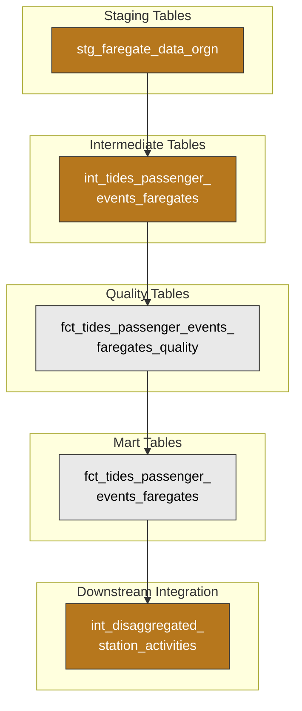
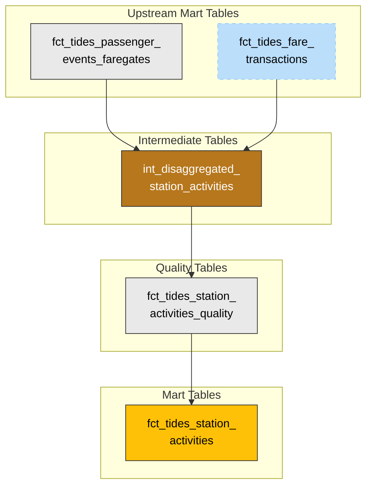

# faregate_data Faregate Data

## Overview and Architecture

### Purpose

- Conform faregate tap events (physical entry and exit at rail stations) to the TIDES passenger events schema with [AGENCY]-proposed modifications.
- Enable analysis of passenger entry and exit patterns at rail stations independent of fare collection.
- Provide linkage between physical tap events and corresponding fare transactions via `linked_transaction_id`.
- Contribute to downstream models on station activities, combining with fare data for complete rail ridership analysis.

### Source System

[AGENCY]'s rail faregate events are managed through the **Fare Data Warehouse (faregate_data)**, which records physical tap-in and tap-out events at Metrorail station faregates. faregate_data provides two primary data streams:

| Dataset | Purpose | Key Content |
| --------- | --------- | ------------- |
| `SOURCE_TABLE_B` (faregate_data_orgn) | Transaction records | Entry and exit events at rail faregates including transaction time, station ID, equipment ID, transaction type, and rider class information |
| `SOURCE_TABLE_A` (faregate_data_mtn) | Maintenance events | Equipment status, alarms, and maintenance events for faregate monitoring and diagnostics |

The faregate_data system captures:

- **Passenger entries** - Tap-in events when passengers enter rail stations through faregates
- **Passenger exits** - Tap-out events when passengers exit rail stations through faregates
- **Equipment events** - Faregate maintenance, alarms, and operational status logs

### Data Flow

#### High-Level

The diagram below shows the data flow for faregate_data faregate data, from ingestion through staging, intermediate transformations, quality checks, and into the TIDES passenger events model, which then combines with fare transactions for station activity analysis.

The following diagram shows the key dbt models in the faregate_data faregate pipeline:

#### Station Activities (Downstream)

The diagram below shows how faregate passenger events combine with fare transactions from FARE and vendor_2 (see [FARE SmarTrip Fares](fare_fares_data.md) and [Open Payment Data](open_payment_data.md)) in the station activities pipeline. `fct_tides_fare_transactions` is shown as a reference since it is documented in those companion docs.

#### Specifics

There are several key phases of faregate_data transformation summarized here and elaborated on in **Transformations** below.

- **Ingestion**: Dagster retrieves daily partitioned data from faregate_data Oracle database tables (`SOURCE_TABLE_B` and `SOURCE_TABLE_A`) and writes to Iceberg tables in Azure storage. Sensitive card identifier fields (`EIS_NUM`, `CSC_NUM`) are redacted during extraction.

- **Staging**: dbt staging models (`stg_faregate_data_orgn` and `stg_faregate_data_mtn`) read from the ingested source tables with minimal transformations. `stg_faregate_data_orgn` also derives `service_date` (4 AM service day boundary from `trxn_dtime`) so that dbt can push incremental batch filters all the way to the source. Note that `stg_faregate_data_mtn` is currently only staged but not used in downstream TIDES models.

- **Intermediate**: The intermediate transformation (`int_tides_passenger_events_faregates`) filters to entry and exit transactions, maps faregate_data fields to the TIDES passenger_events schema, derives event types from transaction codes, and calculates service dates.

- **Quality**: `fct_tides_passenger_events_faregates_quality` applies data quality rules, detects duplicates, validates required fields and accepted event types, and labels rows as valid/invalid with specific invalidity reasons.

- **Integration**: `fct_tides_passenger_events_faregates` presents validated passenger events. These events then feed into `int_disaggregated_station_activities` where they combine with fare transactions for comprehensive rail station analysis.

### Transformations

The source tables are extracted from faregate_data Oracle database. Further transformations occur via dbt-generated SQL. These transformations are elaborated on in the sections below.

## Transformations, TIDES Schema, and Quality

### Transaction Type Mapping

faregate_data origin transactions (`stg_faregate_data_orgn`) capture faregate tap events. The intermediate model filters to entry and exit transactions and maps `trxn_type_cd` to TIDES `event_type`:

| trxn_type_cd | TIDES event_type | Description |
| -------------- | ------------------ | ------------- |
| 01 | `Passenger entry` | Tap-in event when passenger enters station |
| 02 | `Passenger exit` | Tap-out event when passenger exits station |

Other transaction type codes exist in the source data but are filtered out during transformation as they represent non-passenger events or administrative transactions.

### TIDES Schema Conformance

The intermediate transformation (`int_tides_passenger_events_faregates`) converts faregate_data data to the TIDES passenger_events schema. This implementation includes [AGENCY]'s proposed schema modifications currently under consideration by TIDES contributors.

**Key Schema Modifications Implemented:**

1. **device_id required instead of vehicle_id**: Since faregate events occur at fixed station locations (not on vehicles), `device_id` captures the faregate equipment identifier while `vehicle_id` is left null.

2. **trip_stop_sequence optional**: Faregate events are not associated with specific trips, so `trip_stop_sequence` is appropriately null.

3. **linked_transaction_id field**: A new field links passenger events to corresponding fare transactions, enabling correlation between physical tap events and financial transactions.

**Field Mappings:**

| TIDES Field | faregate_data Source | Notes |
| ------------- | ------------ | ------- |
| `passenger_event_id` | `trxn_sno` | Transaction sequence number |
| `service_date` | Derived from `trxn_dtime` | 4 AM service day boundary applied |
| `event_timestamp` | `trxn_dtime` | Transaction datetime |
| `event_type` | Derived from `trxn_type_cd` | Maps to 'Passenger entry' or 'Passenger exit' |
| `device_id` | `eqmt_id` | Equipment/faregate identifier |
| `stop_id` | `stn_id` | Station identifier |
| `event_count` | Fixed as `1` | Each transaction represents one event |
| `linked_transaction_id` | `trxn_sno` | Links to fare transaction if exists |
| `rider_category` | Derived from `rider_cls_cd` | Rider class code (format: "Rider class X") |
| `source_system` | Fixed as `'faregate_data_ORGN'` | Source system identifier |
| `vehicle_id` | `null` | Not applicable for station events |
| `trip_id_performed` | `null` | Not associated with trips |
| `trip_id_scheduled` | `null` | Not associated with trips |
| `trip_stop_sequence` | `null` | Not associated with trips |
| `pattern_id` | `null` | Not applicable for station events |
| `train_car_id` | `null` | Not available in source |
| `location_ping_id` | `null` | Not applicable for fixed locations |

### Rider Class Information

The `rider_cls_cd` field from faregate_data provides rider classification information. Currently, no documentation is available for the specific values of this field, so the intermediate model preserves the original codes in a formatted string ("Rider class X"). Future documentation from [AGENCY] may enable more meaningful rider category classifications.

### Service Date Calculation

Service dates are calculated by applying a 4 AM service day boundary to the transaction datetime (`trxn_dtime`). This means:

- Transactions from 4:00 AM to 3:59 AM the next day are assigned to the same service date
- This aligns with [AGENCY]'s operational service day definition

### Quality

The quality model (`fct_tides_passenger_events_faregates_quality`) applies several validation rules to ensure data integrity:

**Duplicate Detection**: Uses a composite hash of `passenger_event_id`, `service_date`, `event_timestamp`, `event_type`, and `source_system` to identify duplicate records. When duplicates exist, only the first instance (by `_row_id`) is retained.

**Required Field Validation**: Ensures essential fields are populated:

- `passenger_event_id`: Unique identifier for the event
- `service_date`: Calculated service date
- `event_timestamp`: When the event occurred
- `event_type`: Type of passenger event
- `device_id`: Equipment identifier (required per [AGENCY]'s TIDES modification)

**Event Type Validation**: Ensures `event_type` is one of the accepted TIDES values:

- Vehicle arrived at stop
- Vehicle departed stop
- Door opened
- Door closed
- **Passenger entry** (primary faregate event type)
- **Passenger exit** (primary faregate event type)
- Kneel was engaged/disengaged
- Ramp was deployed/raised/failed
- Lift was deployed/raised
- Individual bike boarded/alighted
- Bike rack deployed

> **Note:** The quality model validates `event_type` against the full TIDES enum above, but only `Passenger entry` and `Passenger exit` are expected in faregate data. The remaining event types (vehicle door/kneel/ramp events, bike events, etc.) apply to bus-mounted equipment and will not appear in this pipeline.

**Validity Classification**: Rows are marked as `is_valid = true` only when they pass all validation checks. Invalid rows include an `invalid_reason` field explaining the specific validation failure:

- Missing passenger_event_id
- Missing service_date
- Missing event_timestamp
- Missing event_type
- Missing device_id
- Invalid event_type
- Duplicate record (not first instance)

### Deduplication in Mart Model

The final mart model (`fct_tides_passenger_events_faregates`) includes additional deduplication logic. When multiple valid records share the same `passenger_event_id`, the model:

1. Orders records by `event_timestamp` within each `passenger_event_id`
2. Appends a sequence suffix to the `passenger_event_id` for subsequent records (e.g., "12345-2", "12345-3")
3. Preserves all records while maintaining unique identifiers

### Downstream Integration

Valid passenger events flow into `int_disaggregated_station_activities`, where they combine with fare transactions from `fct_tides_fare_transactions`. This integration:

- Filters faregate events to `source_system = 'faregate_data_ORGN'`
- Maps `event_type` to entry/exit flags
- Preserves `rider_category` information
- Combines with FARE fare transactions for comprehensive station activity analysis

## Key Mart Tables

| Table | TIDES Schema | Description |
| ----- | ------------ | ----------- |
| `fct_tides_passenger_events_faregates` | `passenger_events` | Validated faregate entry/exit events. Feeds into `int_disaggregated_station_activities` (see [Fares and Faregates](fares_and_faregates.md)). |

## Known Limitations and Notes

**faregate_data_MTN Table Not Used**: The maintenance table (`stg_faregate_data_mtn`) is ingested but not currently used in TIDES transformations. It contains equipment events, alarms, and status information that may be valuable for operational analysis but doesn't directly contribute to passenger event tracking. This data could eventually be mapped to a TIDES `device_status` table — see [TIDES issue #242](https://github.com/TIDES-transit/TIDES/issues/242) and [PR #253](https://github.com/TIDES-transit/TIDES/pull/253) for the proposed spec addition.

**Rider Class Documentation**: The `rider_cls_cd` field values are not documented. The current implementation preserves original codes without interpretation, pending [AGENCY] documentation. See [#760](https://github.com/[ORGANIZATION]/[project-name]/issues/760).

**Stop Identifier Consistency**: faregate_data `stn_id` values already use GTFS-compatible station codes (e.g., `A01`) and join directly to `int_gtfs_rail_stops` in `int_disaggregated_station_activities`. FARE and vendor_2 fare transactions use numeric mezzanine IDs instead and require the `rail_mezzanine_to_station` seed to resolve to station codes. See [Fares and Faregates — Known Limitations](fares_and_faregates.md#known-limitations-and-notes).

**No Trip Association**: Unlike bus events, faregate events cannot be directly associated with specific rail trips or vehicles. The TIDES schema modifications address this by making trip-related fields optional — see [TIDES issue #241](https://github.com/TIDES-transit/TIDES/issues/241) and [PR #251](https://github.com/TIDES-transit/TIDES/pull/251) for the proposed passenger_events modifications accommodating faregate and station-based events.

**Transaction Linkage**: While `linked_transaction_id` provides a reference to fare transactions, the linkage methodology may need refinement to accurately match physical tap events with financial transactions, especially when events occur close together in time. See [#761](https://github.com/[ORGANIZATION]/[project-name]/issues/761).

**Limited Transaction Types**: Only transaction types '01' (entry) and '02' (exit) are currently transformed to TIDES passenger events. Other transaction types in the source data may represent additional event types that could be valuable for analysis.

**PII Considerations**: Card identifier fields (`EIS_NUM`, `CSC_NUM`) are redacted during extraction. While this protects customer privacy, it limits the ability to track individual cardholder journeys across the system.

**Entry/Exit Balance**: A quality check validating that faregate entry and exit counts balance at the station level is not yet implemented: [Add entry/exit balance check for faregate passenger_events #653](https://github.com/[ORGANIZATION]/[project-name]/issues/653).

**Historical Data Gaps**: Sample data used for development covers limited date ranges (July-August 2025). Additional validation may be needed when full historical data is available.

## TIDES Schema Modification Proposal

This implementation serves as a reference implementation for [AGENCY]'s proposed modifications to the TIDES passenger_events schema. The key modifications address the challenge of representing station-based events (like faregate taps) that don't naturally fit the vehicle-centric assumptions of the original TIDES specification:

1. **device_id requirement**: Makes `device_id` required instead of `vehicle_id`, with `vehicle_id` becoming optional ("required unless the event occurs at a fixed location").

2. **trip_stop_sequence optionality**: Makes `trip_stop_sequence` optional with a constraint exception ("required unless the event is not associated with a trip").

3. **linked_transaction_id field**: Adds an optional field to link passenger events to corresponding fare transactions, enabling financial and operational data integration.

These modifications allow station-based faregate events to be properly represented without requiring placeholder values for fields that don't semantically apply to fixed-location events.