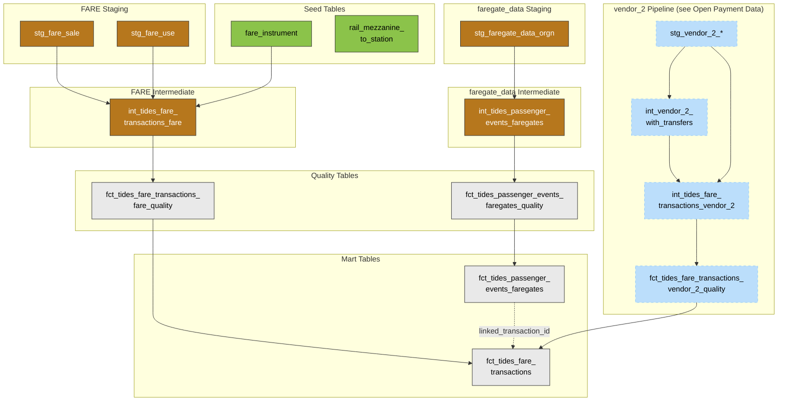

# Fares and Faregates

```{toctree}
:maxdepth: 1

fare_fares_data
faregate_data_faregate_data
open_payment_data
```

## Overview and Architecture

### Purpose

- Conform SmarTrip (FARE) fare card transactions and faregate (faregate_data) passenger events to the standard [TIDES](https://tides-transit.github.io/TIDES/) schema.
- Conform vendor_2 open payment tap transactions to the same TIDES fare transactions schema.
- Combine FARE and vendor_2 fare transactions into a single `fct_tides_fare_transactions` table for cross-system fare reporting.
- Provide station-level passenger entry and exit events from rail faregates, contributing to downstream station activity models.
- Link faregate passenger events to fare transactions via `linked_transaction_id`.

### Source Systems

Three source systems feed the fares and faregates pipeline.

**FARE (vendor_3 Card System):** SmarTrip card data from [AGENCY]'s fare collection system:

| Dataset    | Purpose                         | Key Content                                                                                                                             |
|------------|---------------------------------|-----------------------------------------------------------------------------------------------------------------------------------------|
| `fare_sale` | Card sale and load transactions | Card loads, pass activations, new tickets. `sale_transaction_type` codes 0 to 6 determine the type of sale.                             |
| `fare_use`  | Card tap and use transactions   | Card taps at faregates and on buses: entries, exits, transfers. `use_type` and `use_transaction_type` codes determine the event type.   |

**faregate_data (Fare Data Warehouse):** vendor_3 faregate event data from [AGENCY] rail stations:

| Dataset     | Purpose                      | Key Content                                                                                                         |
|-------------|------------------------------|---------------------------------------------------------------------------------------------------------------------|
| `faregate_data_orgn`  | Faregate transaction records | Individual entry and exit events at rail station faregates. `trxn_type_cd` values `'01'` (entry) and `'02'` (exit). |
| `faregate_data_mtn`   | Station monitoring data      | Equipment monitoring and alarm events. Currently staged but not used in downstream models.                          |

**vendor_2 (Open Payment):** Contactless payment data from [AGENCY]'s open payment platform:

| Dataset     | Purpose                      | Key Content                                                                                                         |
|-------------|------------------------------|---------------------------------------------------------------------------------------------------------------------|
| `dev_txns` / `dev_txn_purchases` | Device transaction records | Individual tap events with location, timing, and transaction type.                               |
| `fares`     | Calculated trip fares        | Complete journey fare amounts with boarding/alighting transaction links and adjustment details.                     |
| `transfers` | Transfer relationships       | Transfer events between trips within the same journey, including intermodal and bus-to-bus transfers.               |
| `micropays`  | Micropayments                | Individual payment charges corresponding to a single journey.                                                       |

### Data Flow

FARE, faregate_data, and vendor_2 data are loaded into Iceberg tables by Dagster, then transformed through dbt staging, intermediate, quality, and mart layers. FARE and vendor_2 fare data converge in `fct_tides_fare_transactions`. faregate_data faregate data flows into `fct_tides_passenger_events_faregates`. The two mart tables can be linked via the `linked_transaction_id` field in passenger events.

All models from staging through mart are materialized as incremental microbatch Iceberg tables partitioned by `service_date`. Each daily batch reads only that day's source partitions, preventing full historical scans. The `service_date` field (4 AM service day boundary) is derived in the staging models so that dbt can push batch filters all the way to the source tables.

The diagram below shows how all three pipelines flow through the dbt model chain and converge at the mart layer.



## Key Mart Tables

| Table                                  | TIDES Schema        | Description                                                                                                                                                  |
|----------------------------------------|---------------------|--------------------------------------------------------------------------------------------------------------------------------------------------------------|
| `fct_tides_fare_transactions`          | `fare_transactions` | Fare transactions from FARE (SmarTrip) and vendor_2 (open payment). Card loads, pass activations, and tap events with amounts, fare media, and fare product. |
| `fct_tides_passenger_events_faregates` | `passenger_events`  | Rail station faregate entry and exit events with device and station identifiers. Can be linked to `fct_tides_fare_transactions` via `linked_transaction_id`. |

## Known Limitations and Notes

**Rail Station Identifier Mapping (Mezzanine IDs)**: FARE and vendor_2 fare transactions identify locations using numeric mezzanine IDs (`stop_point_id` in FARE, `location_id` in vendor_2), not GTFS station codes. A [AGENCY] rail station has one or more mezzanines — physical entry/exit points with faregates (e.g., Farragut North `A02` has three mezzanines, IDs 2/3/4, for different street entrances). faregate_data faregate events use GTFS-compatible station codes directly. The `rail_mezzanine_to_station` seed (125 mezzanines → 101 stations) provides the crosswalk, extracted from `bus_calendar_db.RAIL_NET_MEZZANINE`:

```sql
SELECT ID AS mezzanine_id, STATION_CODE AS station_code, NAME_RR AS mezzanine_name
FROM bus_calendar_db.RAIL_NET_MEZZANINE ORDER BY ID
```

The mapping was validated through three independent Oracle sources: (1) `bus_calendar_db.FARE_USE_TRANSACTION_ALL_V` carries `STOP_POINT_ID`, `MEZZ_ID` (zero-padded string form), and `MSTN_ID` on the same row, confirming `STOP_POINT_ID = RAIL_NET_MEZZANINE.ID`; (2) `bus_calendar_db.RAIL_NET_MEZZANINE` provides the authoritative `ID → STATION_CODE → MSTN_ID` lookup, cross-checked against `RAIL_NET_STATION`; (3) `PLANAPI.GIS_RAIL_MEZZ_V` independently maps `LOCATIONCODE → STATIONCODE` with identical values. Coverage on dev (2026-03-22): 95% of vendor_2 and 89% of FARE rail fare transaction records match a mezzanine ID. Unmatched records are bus `stop_point_id` values (NULL `MEZZ_ID` in the source) or empty-string vendor_2 `location_id` values. `int_disaggregated_station_activities` joins fare transactions to the seed on `stop_id = mezzanine_id`, then uses the resolved `station_code` to join GTFS rail stops. The seed should eventually be replaced with an ingested source table (see `docs/tickets/replace_mezzanine_seed_with_source.md`).

**Ridership Validation**: After applying the mezzanine mapping, `int_disaggregated_station_activities` entry/exit totals were compared against an external [AGENCY] ridership benchmark (which includes some non-fare-paid and fare evasion records). System-wide on Mar 6, our model produced ~470K entries / ~471K exits vs benchmark ~456K / ~458K (within 3%, expected given overlap between faregate_data faregate events and fare transactions). At the station level, Pentagon (C07) on Mar 6 produced 9,476 entries / 9,060 exits vs benchmark 9,609 / 9,370 (within 2-3%).

**FARE `stop_point_id` Scientific Notation on Trino**: The FARE source stores `stop_point_id` as a double (Iceberg/Parquet artifact from the Oracle NUMBER type). Casting directly to VARCHAR on Trino produces scientific notation (e.g., `'4.4E1'` instead of `'44'`), breaking downstream string joins. Fixed in `stg_fare_use` by casting through bigint first (`flex_cast(flex_cast('stop_point_id', 'bigint'), 'varchar')`).