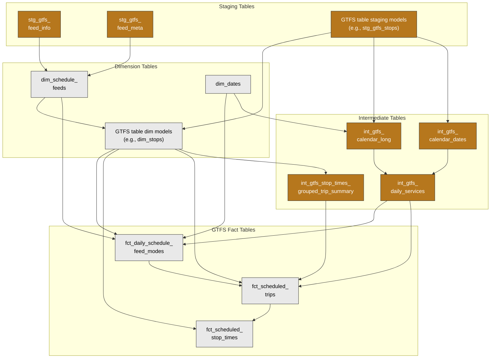
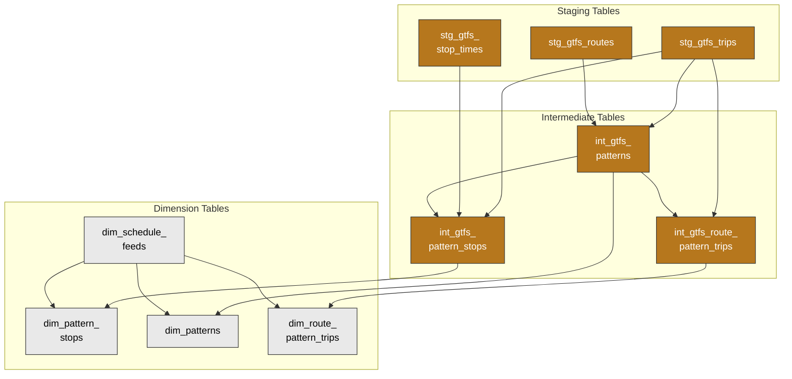
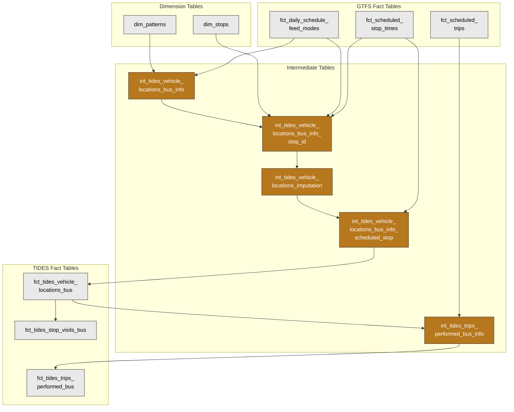

# GTFS Schedule Data

This document explains how GTFS schedule data flows through the warehouse, from ingestion to the key mart tables used for analysis. For GTFS specification details, see [gtfs.org](https://gtfs.org/documentation/schedule/reference/).

## Overview and Architecture

### Purpose

- In the TIDES architecture, GTFS schedule data serves as a reference for scheduled trips, stop locations and identifiers, route types, and more.
- In the [Project Name], GTFS also supports enhancements to operational data as it is transformed into TIDES models. For example, GTFS data is used to correct the association of vehicle locations to stop_ids, as well as to identify which trips are in-service (as opposed to non-revenue service vehicle movements).

### Source System

[AGENCY] publishes GTFS feeds via these API endpoints:

| Feed | Endpoint |
|------|----------|
| Combined Bus+Rail | `https://api.[AGENCY].com/gtfs/rail-bus-gtfs-static.zip` |
| Bus Only | `https://api.[AGENCY].com/gtfs/bus-gtfs-static.zip` |
| Rail Only | `https://api.[AGENCY].com/gtfs/rail-gtfs-static.zip` |

Currently, the pipeline ingests the **combined bus+rail feed**. The feed type (Combined, Bus, Rail) is determined from the source URL and stored in `dim_schedule_feeds._feed_type`. The warehouse includes flexibility to accommodate additional mode-specific feeds and to resolve and prioritize service from overlapping feeds.

### Extraction, Loading, and Feed Versioning

Dagster orchestrates the daily feed download (scheduled at 4am).

1. Download GTFS zip from API
2. Sort zip contents alphabetically (for deterministic hashing)
3. Generate MD5 hash of sorted zip → `_feed_hash`.  
4. If hash exists, skip processing; if new, extract zip files, upload and partition downstream tables based on `_feed_hash`

### Transformations

Transformations occur via dbt-generated SQL. These transformations are elaborated on in the sections below.

### Data Flow

#### High-Level

The diagram below shows the simplified data flow for GTFS schedule data, focusing on how GTFS data flows from the [AGENCY] API through staging, intermediate transformations, dimension and fact tables, combines with Bus info data, and ultimately flows on to TIDES models.

#### Scheduled Trips and Stop Times

There are several key phases of GTFS transformation summarized here and elaborated on in **Transformations** below.

- **Staging**: Dagster loads raw GTFS data from the API to partitioned Iceberg/Parquet tables (all fields as strings, with `feed_hash` added). dbt staging models then read these source tables and cast fields to appropriate types (e.g., `direction_id` as integer). Staging tables include both tables from the GTFS specification (e.g., stop_times) as well as a metadata table `stg_gtfs_feed_meta` generated by Dagster.
- **Intermediate**: Several transformations of GTFS tables are needed before they can be used in downstream models. These include:
  - A complete calendar of daily services `int_gtfs_daily_services` based on GTFS calendar and calendar dates tables.
  - Aggregations of stop_times records to the trip level (e.g., first and last stop, first and last departure time)
- **Dimension**: The validity of feeds is determined through `dim_schedule_feeds`, which calculates `_valid_from` and `_valid_to` dates. Downstream GTFS dimension models join to `dim_schedule_feeds` on `_feed_hash` to validate feed existence but do not carry `_valid_from`/`_valid_to` columns themselves. This is because determining validity for specific services can be complicated (see [Overlapping Feed Validity](#overlapping-feed-validity)).
- **Fact**: The key output tables of GTFS processing are the following:
  - **`fct_scheduled_trips`**: One record for each trip operated on a service date.
  - **`fct_scheduled_stop_times`**: One record for each scheduled stop visit on a service date.
  - Both of the above are derived from `fct_daily_schedule_feed_modes`, which establishes for each date and each mode (bus and rail) what GTFS feed is to be used.
  - Only service dates up to the current calendar date (i.e., today's date) are shown in the `fct_scheduled...` models.

A simplified representation of GTFS' role in the [Project Name] is shown in the diagram below.

#### Patterns

Patterns represent the ordered sequence of stops visited on a trip. While not a part of the GTFS specification, they are inherent when sequences of stop_ids are repeated across different scheduled trips. In the [Project Name], patterns are used to identify revenue service. Additional detail on how patterns are constructed is described in **Pattern Derivation** below.

The creation of pattern tables is shown in the diagram below. Not all relationships are shown.

## Connection to Other TIDES Tables

GTFS models connect to TIDES tables through TIDES vehicle locations, as shown in the diagram below. While `int_tides_vehicle_locations_bus_info` is the primary 'landing' for Bus info data, several rounds of transformations are applied to this data through the intermediate models `int_tides_vehicle_locations_bus_info_stop_id` and `int_tides_vehicle_locations_bus_info_scheduled_stop`.

A simplified relationship between GTFS and TIDES models is shown below; not all relationships are present.

When connecting GTFS to TIDES, `trip_id` is matched to `trip_id_scheduled` per the TIDES specification. `trip_id_scheduled` values are derived from Bus info, and largely match values from GTFS. However, due to operator logon errors or other differences, these values may not always match. The dbt test `test_bus_info_scheduled_trips_exist_in_gtfs` identifies known failures.

For further discussions of connections between GTFS and vehicle locations, see **Differences Between [Project Name] Implementation and TIDES Architecture** in the section **Known Limitations and Notes** below.

## Key Transformations

### Calendar Expansion

GTFS uses two files for service schedules: `calendar.txt` (day-of-week patterns with date ranges) and `calendar_dates.txt` (exceptions). We expand these into a daily format:

- **`int_gtfs_calendar_long`**: Generates one row per (feed_hash, service_id, date) for all dates between start_date and end_date. Flags `has_service` based on day-of-week columns.
- **`int_gtfs_calendar_dates`**: Transforms exception types into boolean service flags.
- **`int_gtfs_daily_services`**: Merges both via full outer join, including only dates and service_id where service is present.

### Feed Validity and Mode Selection

Multiple feed versions may have overlapping validity periods. The warehouse handles this through:

- **`dim_schedule_feeds`**: Calculates `_valid_from` (greater of feed_start_date or retrieval date) and `_valid_to` (earliest of next feed retrieval, feed_end_date, or 1 year default).
- **`fct_daily_schedule_feed_modes`**: For each service_date and mode (Bus/Rail), selects the most recent valid feed that was retrieved before noon on that service date. Combined feeds are expanded into separate Bus and Rail rows. Each mode gets its own effective validity window: a feed's validity for a mode starts when the feed actually has active service for that mode (based on trips joined through `int_gtfs_daily_services`, `dim_trips`, and `dim_routes`), and extends until the next feed can serve that mode. This handles cases where a Combined feed's rail service_ids don't become active until days after the feed is retrieved -- the previous feed continues to serve Rail until the new feed's rail service begins. This also accommodates cases where, for example, a Rail feed is added that updates rail services for a range of dates but Bus service (from the combined feed) is unmodified.

### Pattern Derivation

Patterns represent the ordered sequence of stops visited on a trip. While not a part of the GTFS specification, they are inherent when sequences of stop_ids are repeated across different scheduled trips. At [AGENCY], patterns are assumed to be associated to shape_ids (line geometries) on a one-to-one basis. As a result, pattern_id names are drawn from shape_id values and slightly reformatted to remain consistent with Bus info pattern_ids.  

The pattern_id derivation assumes [AGENCY]'s shape_id formatting conventions:

- Bus shapes use colon (`:`) delimiters
- Rail shapes use underscore (`_`) delimiters

Changes to these conventions would require model updates.

**`dim_patterns`** is the key pattern table. Through the upstream model `int_gtfs_patterns`, `dim_patterns` includes a `pattern_id` by stripping delimiters from `shape_id` (colons for bus
routes, underscores for rail)

Two other pattern-related dimension models exist:

- **`dim_pattern_stops`**: Extracts stop sequences per pattern. Future data quality checks may leverage this to check the validity of stop sequences on a trip when Bus info `pattern_id` is present but `trip_id_scheduled` is null.
- **`dim_route_pattern_trips`**: Used for a data quality check that verifies that pattern_id values from bus info data match the pattern_id values derived from GTFS trips

In the [Project Name], patterns are used to identify revenue service. If a Bus info pattern_id is found in GTFS pattern_ids, the trip is identified as having `schedule_relationship` `'In Service'`.

The `pattern_id` field serves as the primary link between GTFS schedule data and operational bus info telemetry.

## Key Mart Tables

| Table | Description |
|-------|-------------|
| `fct_scheduled_trips` | One row per trip operated on a service date. Includes route, timing, and stop count aggregations. |
| `fct_scheduled_stop_times` | One row per scheduled stop visit. Includes arrival/departure times and stop details. |
| `fct_daily_schedule_feed_modes` | Maps each service_date + mode to the applicable feed_hash. |
| `dim_schedule_feeds` | Feed metadata with source, retrieval date, version, and validity window. |
| `dim_patterns` | Pattern reference data for matching to vehicle locations. |
| `dim_stops` | Stop location reference data for matching to vehicle locations. |

## Known Limitations and Notes

### [AGENCY]-Specific Files

The [AGENCY] GTFS feed includes two non-standard files not part of the official GTFS specification:

- **`timepoints.txt`**: Timing points associated with stops, typically intersections or landmarks
- **`timepoint_times.txt`**: Scheduled passing times at timepoints generated by [AGENCY]'s scheduling system

These are exposed as `dim_gtfs_timepoints` and `dim_gtfs_timepoint_times`. Currently, these are not used in the warehouse pending further exploratory data analysis on their consistency with other sources of timepoint data at [AGENCY] (see [ticket #673](https://github.com/[ORGANIZATION]/[project-name]/issues/673)).

### Overlapping Feed Validity

- When multiple feeds cover the same date range, the most recently retrieved feed (prior to service date) is selected. This may not always reflect the "correct" schedule if feeds are published out of sequence.
- `fct_daily_schedule_feed_modes` computes per-mode effective validity windows. A feed's validity for a given mode (Bus or Rail) starts when the feed actually has active service for that mode. This means Bus and Rail may use different feeds on the same date when a newly retrieved Combined feed has rail service_ids that don't activate until later. In this scenario, the previous feed continues to provide Rail coverage until the new feed's rail service begins. A data quality test (`test_scheduled_trips_no_mode_gaps`) checks for dates where a mode is missing scheduled trips. See [issue #809](https://github.com/[ORGANIZATION]/[project-name]/issues/809) for background.
- `_valid_from` and `_valid_to` fields on `dim_schedule_feeds` are representative of the overall validity of the corresponding feed represented by `_feed_hash`. However, in some cases, a given `_feed_hash` may not be in use to define service on a given service date if other feeds take precedence per `fct_daily_schedule_feed_modes` (see above bullet). As a result, GTFS `dim_` models do not carry a `_valid_from` or `_valid_to` date; `fct_scheduled_trips` and `fct_scheduled_stop_times` are the most accurate representations of what GTFS entities are valid at a given point in time.

### Calendar Expansion Bounds

Calendar expansion generates rows through December 31, 2099. Feeds with start_date > end_date are filtered out but not explicitly flagged.

### Differences between [Project Name] Implementation and TIDES Schema Architecture

The [Project Name] defines relationships between GTFS models and other TIDES models differently from [the TIDES Schema Architecture](https://tides-transit.org/main/architecture/#relationships).

Some relationships between GTFS and TIDES models are not yet implemented:

- `station_activities` should include references to GTFS `stop_id` values, but this is not yet implemented.
- `vehicles`, a GTFS table proposed in the TIDES spec, is not implemented.
- `passenger_events` is also not implemented in the [AGENCY] [Project Name] because Bus info includes AVL and APC data together; it is more straightforward to create `vehicle_locations`, then add additional ridership data from Bus info when generating `stop_visits` from `vehicle_locations`.
- `fare_transactions` does not yet include relationships to GTFS tables.

Other relationships are implemented in a slightly different fashion:

- Rather than a direct connection between GTFS `stop_times` and `vehicle_locations`, `fct_scheduled_stop_times` is used to build a picture of scheduled service at each service date. Similarly, `trips_performed` is connected to schedule data via `fct_scheduled_trips`, rather than directly to a GTFS `trips` table.
- Patterns are not defined in the GTFS or TIDES specification, but are used to identify when trips in `vehicle_locations` have a schedule relationship.