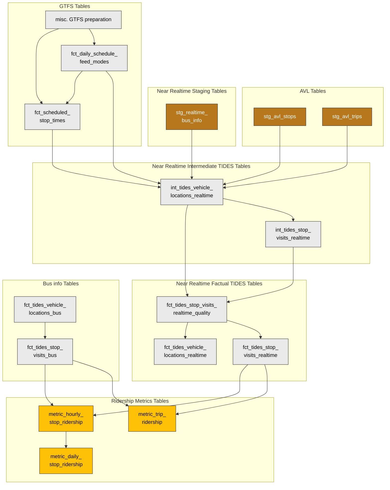

# Near Real-Time Bus

## Overview and Architecture

### Purpose

The near real-time (NRT) bus pipeline provides vehicle location and stop visit data with significantly lower latency than the historical bus info pipeline. While historical bus info data arrives as daily product file exports processed the following day, NRT bus data is extracted directly from the live CAD/AVL system in rolling time windows throughout the day. This enables operational monitoring, same-day performance reporting, and faster data availability for downstream consumers.

Both pipelines ultimately produce [TIDES](https://tides-transit.github.io/TIDES/)-formatted fact tables (`fct_tides_vehicle_locations` and `fct_tides_stop_visits`).

### Source System

The NRT bus data originates from the **vendor_1 CAD (Computer-Aided Dispatch) system**, specifically the `AVL.LOG_CC_VEHICLEWORK` table in an Oracle database. This table is a log of vehicle work states maintained by the CAD server and is updated as vehicles report their positions and status in real time.

Two additional AVL lookup tables enable us to construct the TIDES model:

- **`route_lookup_crosswalk`** - Trip and route schedule information (block, trip, route variant, revenue status)
- **`stop_lookup_crosswalk`** - Stop geographic identifiers, mapping vendor_1 internal stop IDs to GTFS-compatible `stop_id` values

### Data Flow

The diagram below shows the simplified data flow for the bus realtime data, focusing on how it flows from the Oracle database through staging, intermediate transformations, dimension and fact tables, combines with GTFS data and Bust State data and ultimately flows on to TIDES models.

### Translation to TIDES Schema

The diagram below shows an overview of how the bus realtime data passes through multiple intermediate models, connecting with GTFS and Bus info data, and transforms into the TIDES models.

### Comparison with Historical Bus info

| Aspect | Historical Bus info | Near Real-Time Bus info |
| --- | --- | --- |
| **Source** | product file exports (CSV) | AVL Oracle DB (`LOG_CC_VEHICLEWORK`) |
| **Ingestion cadence** | Daily partitions | 2-hour time window partitions |
| **Latency** | Next-day | ~2 hours |
| **Event granularity** | Rich event types (serviced stop, unserviced stop, route change, timepoint, audio events, etc.) | Vehicle work state snapshots (position, trip, schedule deviation) |
| **Trip ID linkage to GTFS** | Mapped through imputation pipeline | Trip ID does not directly match GTFS |
| **Stop visit detection** | Based on event types 3/4/5 (serviced/unserviced/unknown stop) | Derived by detecting first appearance of each stop within a trip (for now, follow up ticket created) |
| **APC data** | Per-door boarding/alighting counts | Single APC on/off count per stop visit (repeated across vehicle location rows) |
| **Fact tables** | `fct_tides_vehicle_locations_bus`, `fct_tides_stop_visits_bus` | `fct_tides_vehicle_locations_realtime`, `fct_tides_stop_visits_realtime` |

The stop visit fact tables are later merged to create the mart bus ridership tables.

## Ingestion and Processing

### Time Window Partitioning

The Dagster pipeline extracts data from Oracle in time window partitions (currently 2-hour intervals; the exact window size is subject to change). Each partition queries `LOG_CC_VEHICLEWORK` for rows where `LOCATIONUPDATEDTS` falls between the window start and end times.

The schedule is built automatically from the partition definition. Data is written to cloud storage partitioned by day, with an overwrite strategy of `time_between` (re-running a partition replaces only that window's data).

### dbt Model Chain

The raw AVL data is transformed through a series of dbt models:

**Staging:**

- `stg_realtime_bus_info` - Stages data and computes `service_date` using the 4 AM boundary.
- `stg_avl_trips` / `stg_avl_stops` - Stage the two AVL lookup tables for trip/route and stop information.

**Intermediate:**

- `int_tides_vehicle_locations_realtime` - The core transformation model. Joins the staged realtime data with AVL trips (to get route, revenue status, trip times) and AVL stops (to map vendor_1 stop IDs to GTFS `stop_id`). Detects stop visits by taking the first instance of each `currentstopid` within a trip. Maps all fields to the TIDES `vehicle_locations` schema.
- `int_tides_stop_visits_realtime` - Filters vehicle locations to confirmed stop visits only (revenue service, at a known stop) and maps to the TIDES `stop_visits` schema.

**Quality and Mart:**

- `fct_tides_vehicle_locations_realtime_quality` / `fct_tides_stop_visits_realtime_quality` - Quality validation layer (currently placeholder; see Known Limitations).
- `fct_tides_vehicle_locations_realtime` / `fct_tides_stop_visits_realtime` - Final fact tables, filtered to valid rows.

### Data Freshness Considerations

- Data freshness depends on the configured time window interval (currently 2 hours).
- The `LOCATIONUPDATEDTS` column drives the time-window query. Rows with delayed updates could appear in a later window than expected.

## Key Mart Tables

| Table | TIDES Schema | Description |
| ----- | ------------ | ----------- |
| `fct_tides_vehicle_locations_realtime` | `vehicle_locations` | Real-time vehicle location pings from AVL. |
| `fct_tides_stop_visits_realtime` | `stop_visits` | Derived stop visit records from real-time vehicle locations. |

## Known Limitations and Notes

**Quality checks are placeholders.** The quality models currently mark all rows as valid. A follow up ticket will populate the quality models ([#734 Populate realtime quality models](https://github.com/[ORGANIZATION]/[project-name]/issues/734)).

**Stop visit detection is approximate.** The `currentstopid` field from AVL can "jitter" between recent stops. The current logic takes the first instance of each stop per trip, but does not yet handle legitimate revisits to the same stop on a single route ([#733 Improve stop visit detection](https://github.com/[ORGANIZATION]/[project-name]/issues/733)).

**Several TIDES fields are not yet populated.** Fields including `trip_id_performed`, `trip_stop_sequence`, `scheduled_stop_sequence`, `dwell`, `actual_departure_time`, and `departure_load` are NULL in the current pipeline. Not all may be fillable due to how the data is like. Filling some of these will require applying data cleaning and imputation steps similar to the historical bus info pipeline ([#731 Apply bus info cleaning steps to realtime](https://github.com/[ORGANIZATION]/[project-name]/issues/731)). Note also that `trip_id_scheduled` comes from the vendor_1 system — none of the vendor_1 trip ID fields correspond to GTFS `trip_id`.

**Low GPS precision.** Lat/lon values currently have only ~3 decimal places of precision (~100m accuracy), which limits spatial analysis ([#732 Re-ingest with higher lat/lon precision](https://github.com/[ORGANIZATION]/[project-name]/issues/732)).

**Data overlap with bus info pipeline.** The realtime pipeline ingests data from AVL logs that may overlap with data already present in the bus info pipeline. If both sources cover the same time period, downstream models that union the two (e.g., `metric_hourly_stop_ridership`, `metric_trip_ridership`) could double-count ridership and vehicle locations. As a placeholder fix, near-realtime data is currently used only for same-day ridership, while bus info data is used for next-day and beyond ([#737 Address NRT/bus info overlap](https://github.com/[ORGANIZATION]/[project-name]/issues/737)).