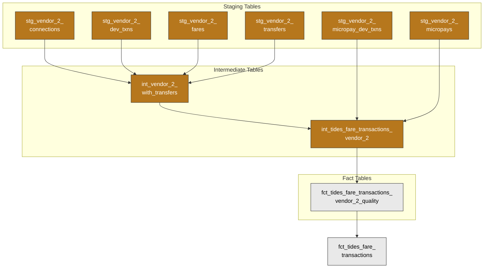

# Open Payment Data

## Overview and Architecture

### Purpose

- Conform open, i.e. contactless, payment transactions (tap-in/tap-out events) to standard TIDES fare transactions format, merged with fare transactions coming from SmarTrip cards.
- Enable the analysis of fare transactions from open payment methods to understand customer travel patterns and complete customer journeys including transfers and connections.
- Contribute to downstream models on station activities.

### Source System

[AGENCY] processes contactless payments through **vendor_2**, an open payment platform that handles tap-based transactions. vendor_2 provides several data streams:

| Dataset | Purpose | Key Content |
| --- | --- | --- |
| `dev_txns` | Device transaction records | Individual tap events with location, timing, transaction type (on, off, single), and outcome details |
| `dev_txn_purchases` | Device transaction purchases | Similar to above for the purposes of this pipeline. |
| `fares` | Calculated trip fares | Complete journey fare amounts with boarding/alighting transaction links and adjustment details |
| `transfers` | Transfer relationships | Transfer events between trips within the same journey, including intermodal and bus-to-bus transfers |
| `connections` | Trip connections | Connections between trips including virtual tunnel use events, both permanent ones like between the Farraguts and temporary ones during construction|
| `micropays` | Micropayments | Individual payment charges with amounts corresponding to a single journey (on rail each micropayment corresponds to an on transaction and an off transaction) |
| `micropay_dev_txns` | Payment-transaction links | Association between micropayments and device transactions |
| `settlements` | Financial settlements | Payment settlement records. Can correspond to multiple micropayments during a settlement window, typically a day. Currenly not used in downstream models. |
| `evt_txn_recv` | Real-time events | Near real-time transaction event stream for operational monitoring. Currently ingested but not further transformed. |

Sources are partially documented in [these files]([link redacted]).

### Data Flow

#### High-Level

The diagram below shows the simplified data flow for open payment data, focusing on how vendor_2 data flows through staging, intermediate transformations, quality checks, and ultimately combines with FARE-based SmarTrip data into a unified TIDES fare transaction model.

#### Specifics

There are several key phases of vendor_2 transformation summarized here and elaborated on in **Transformations** below.

- **Staging**: Dagster loads raw vendor_2 data to partitioned Iceberg tables. dbt staging models then read these source tables and cast fields to appropriate types, creating staging models for each vendor_2 dataset (connections, dev_txns, fares, transfers, micropayments, and settlements).

- **Intermediate**: Two primary intermediate transformations prepare vendor_2 data for TIDES conformance:
  - `int_vendor_2_with_transfers` combines fare transactions with transfer and connection details, expanding fares (which exist at the micropyment level) to individual transaction level via boarding/alighting transaction IDs.
  - `int_tides_fare_transactions_vendor_2` transforms vendor_2 data to TIDES fare transaction schema, joining micropayment and transaction details and retaining some additional columns outside of the TIDES schema including joining columns for micropayments and additional details about nominal and charged fares and fare adjustments.

- **Quality**: `fct_tides_fare_transactions_vendor_2_quality` applies data quality rules, labels rows as valid/invalid, and specifies invalidity reasons.

- **Integration**: `fct_tides_fare_transactions` combines vendor_2 open payment transactions with upstream farecard (SmarTrip) transactions from FARE. The upstream FARE models and the integration logic are detailed in separate documentation and diagrams covering the complete fare transaction domain.

### Transformations  

The source tables are transformed by vendor_2. Further transformations occur via dbt-generated SQL. These transformations are elaborated on in the sections below.

## Transformations, TIDES Schema, and Quality

### Transaction Expansion and Transfer Integration

vendor_2's `fares` table contains important fare adjustment information but is at the level of a complete journey. The first intermediate transformation (`int_vendor_2_with_transfers`) takes `fares` as its departure point but brings it closer to TIDES specifications, which require individual transaction events. The intermediate model:

- **Expands fare records** to individual transaction level by splitting each fare into separate boarding and alighting transactions using `boarded_vendor_2_txn_id` and `alighted_vendor_2_txn_id`.
- **Handles transaction deduplication** from `dev_txns`, prioritizing records with location information when multiple records exist for the same transaction ID.
- **Integrates transfer relationships** by joining with both `transfers` (intermodal or bus-to-bus transfers) and `connections` (virtual tunnel events).
- **Derives fare actions** based on transaction type and transfer status, creating standardized actions like 'Enter', 'Exit', 'Transfer entrance', and 'Transfer exit'.

### TIDES Schema Conformance

The second intermediate transformation (`int_tides_fare_transactions_vendor_2`) converts vendor_2 data to the standard [TIDES fare transaction schema](https://tides-transit.org/main/tables/#fare-transactions). For example, it:

- **Joins micropayment data** to link individual tap events with their corresponding payment charges and settlement information.
- **Calculates service dates** by converting UTC timestamps to local timezone and applying the 4-hour service day boundary (4 AM cutoff).
- **Standardizes field mappings** to TIDES schema, including `route_id` → `pattern_id`, `location_id` → `stop_id`, and setting standard values like `num_riders: 1` and `fare_media_id: 'Bank card'`.
- **Maps charge logic** based on fare type: flat fares and incomplete variable fares assign the full charge amount to the sole transaction (usually entry but sometimes exit), while complete variable fares only assign the charge amount on exit transactions. More specifically:

| Charge Type | Description | Amount Assignment |
| --- | --- | --- |
| `flat_fare` | Fixed fare on bus or rail | Charge on entry |
| `incomplete_variable_fare` | Single valid tap (entry or exit only) on rail | Charge on the single transaction |
| `complete_variable_fare` | Complete tap-in/tap-out journey on rail | Charge assigned only on exit transaction |

### Quality

The quality model (`fct_tides_fare_transactions_vendor_2_quality`) applies several validation rules to ensure data integrity and consistency before open payment transactions are merged with farecard transactions and integrated into the final TIDES model:

**Duplicate Detection**: Uses a composite hash of `event_timestamp` and `device_id` to identify duplicate records. When duplicates exist, only the first instance (by `transaction_id`) is retained.

**Complete Variable Fare Balancing**: For rail transactions with `charge_type = 'complete_variable_fare'`, the quality model validates that each micropayment has exactly one entry transaction and one exit transaction. Unbalanced micropayments (missing entry/exit or multiple entries/exits) are flagged as invalid.

**Required Field Validation**: Ensures essential fields are populated:

- `transaction_id`: Unique identifier for the transaction
- `service_date`: Calculated service date for the transaction
- `event_timestamp`: When the transaction occurred  
- `fare_action`: Type of fare action (Enter, Exit, Transfer entrance, Transfer exit)
- `micropayment_id`: Link to the associated payment record

**Validity Classification**: Rows are marked as `is_valid = true` only when they pass all validation checks. Invalid rows include an `invalid_reason` field explaining the specific validation failure, such as:

- Missing required fields
- Duplicate records (not first instance)
- Unbalanced complete variable fare micropayments
- Multiple entry/exit records for the same micropayment

## Key Mart Tables

| Table | TIDES Schema | Description |
| ----- | ------------ | ----------- |
| `fct_tides_fare_transactions` | `fare_transactions` | Unified fare transactions combining vendor_2 open payment and FARE SmarTrip sources (see [Fares and Faregates](fares_and_faregates.md)). |

## Known Limitations and Notes

**Incomplete documentation**: Currently the pipeline largely documents the fields that are used and transformations, but does not document all source columns. A ticket has been created to address that: [vendor_2 field documentation #606](https://github.com/[ORGANIZATION]/[project-name]/issues/606).

**Unused Data Streams**: Several vendor_2 datasets are currently ingested but are not yet incorporated or were deemed not necessary for the scope of this project:

- `settlements` data provides financial settlement records but is not necessary for our purposes.
- `dev_txn_purchases` does not provide additional necessary information beyond `stg_vendor_2_dev_txns` for our purposes.
- `evt_txn_recv` real-time event stream is ingested but not yet transformed for downstream use.

**Inadequate traceability**: Due to deduplication logic and pivoting that lives within some of the intermediate models, the disposition of each source row is not always clear. A ticket has been created with details on how to improve traceability: [Improve vendor_2 traceability #610](https://github.com/[ORGANIZATION]/[project-name]/issues/610).

**Lack of Bus Sample Data**: The sample data used to develop the pipeline had very little bus data due to a later rollout of open payment on Metrobus. The system is designed to properly ingest the little bus data that existed, but follow up tickets exist to ensure the system is properly capturing bus and intermodal data, including columns that are expected to be filled only for bus (e.g., information about route and vehicle).

- [Verify that vendor_2 intermodal transfers are handled well by fare_transactions and downstream models #596](https://github.com/[ORGANIZATION]/[project-name]/issues/596)
- [Ensure vendor_2 route_id match GTFS route_id or pattern_id from other tables #615](https://github.com/[ORGANIZATION]/[project-name]/issues/615)
- [Clean up vehicle_id on vendor_2 #622](https://github.com/[ORGANIZATION]/[project-name]/issues/622)

**Stop identifiers**: vendor_2 `location_id` is a numeric mezzanine ID (e.g., 44 for Pentagon City). The `rail_mezzanine_to_station` seed maps these to GTFS station codes (e.g., `C08`), enabling the join in `int_disaggregated_station_activities`. See [Fares and Faregates — Known Limitations](fares_and_faregates.md#known-limitations-and-notes) for the full validation chain.

**Transfer Window Logic**: The current transfer detection relies on vendor_2's pre-calculated transfer relationships rather than implementing independent transfer window logic, which may not capture all potential scenarios considered 'transfers' by an analyst. See [#762](https://github.com/[ORGANIZATION]/[project-name]/issues/762).

**Fare Media Classification**: `Mobile NFC` is another possible value for TIDES Fare Transactions `fare_media_id` but without bringing in another vendor_2 dataset it is not possible to distinguish between cards and mobile NFC taps, or further between phone and watch taps. Currently all open payment transactions are classified as `'Bank card'`. See [#763](https://github.com/[ORGANIZATION]/[project-name]/issues/763).

**Pending Quality Enhancements**: Several additional quality checks have been identified but not yet implemented:

- [Add fare amount range validation to vendor_2 quality model #647](https://github.com/[ORGANIZATION]/[project-name]/issues/647)
- [Add transfer transactions quality check ensuring zero amount #648](https://github.com/[ORGANIZATION]/[project-name]/issues/648)
- [Validate temporal ordering for variable fares timestamps #649](https://github.com/[ORGANIZATION]/[project-name]/issues/649)
- [Add settlement reconciliation check for vendor_2 fare data #650](https://github.com/[ORGANIZATION]/[project-name]/issues/650)
- [Add adjustment amount reasonableness checks for vendor_2 #651](https://github.com/[ORGANIZATION]/[project-name]/issues/651)